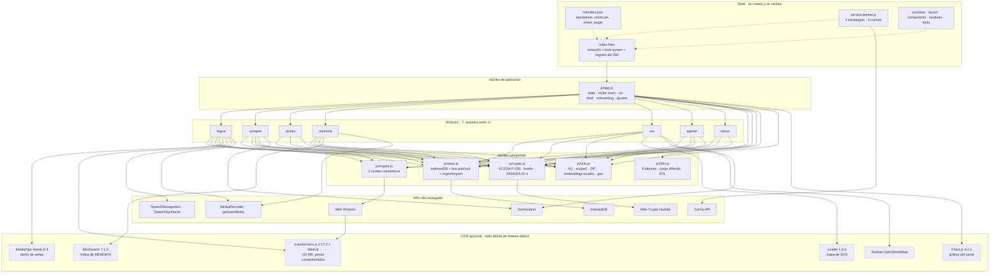
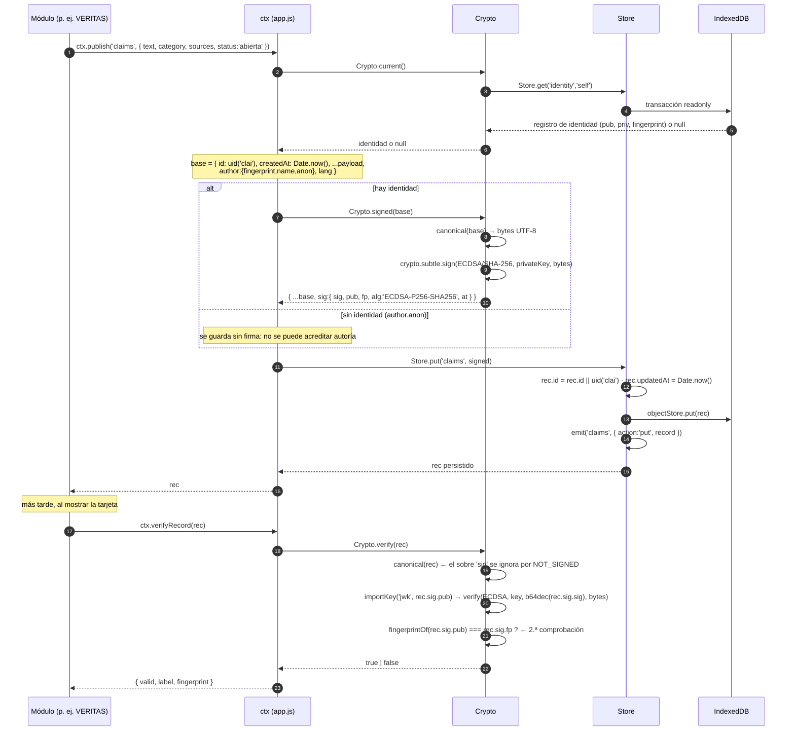
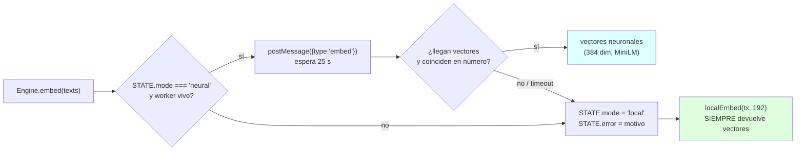

# PANGEA · Arquitectura

> Documento técnico de referencia para quien va a **evaluar, desplegar, auditar o extender** el código.
> Versión de la aplicación documentada: `1.0.0` (`js/app.js`, constante `VERSION`).
> Todo lo que sigue está trazado a archivos y funciones reales del repositorio. Cuando el código
> contradice lo que uno esperaría leer en un comentario, se dice explícitamente (§13.7).

---

## Índice

1. [Visión y principios de diseño](#1-visión-y-principios-de-diseño)
2. [Diagrama de capas](#2-diagrama-de-capas)
3. [El contrato de módulo](#3-el-contrato-de-módulo)
4. [Modelo de datos](#4-modelo-de-datos)
5. [Modelo criptográfico](#5-modelo-criptográfico)
6. [Motor semántico y degradación](#6-motor-semántico-y-degradación)
7. [Algoritmos propios](#7-algoritmos-propios)
8. [Entrega sin conexión (Service Worker)](#8-entrega-sin-conexión-service-worker)
9. [Internacionalización](#9-internacionalización)
10. [Accesibilidad y rendimiento](#10-accesibilidad-y-rendimiento)
11. [Verificación](#11-verificación)
12. [Decisiones y alternativas descartadas](#12-decisiones-y-alternativas-descartadas)
13. [Deuda técnica y límites conocidos](#13-deuda-técnica-y-límites-conocidos)

---

## 1. Visión y principios de diseño

PANGEA es una PWA *local-first* que funciona como sistema operativo de la inteligencia colectiva
humana: empareja problemas con capacidades, verifica información por consenso, preserva conocimiento,
responde a emergencias y traduce, **sin servidores propios, sin cuentas y sin rastreadores**.

Cinco principios no negociables explican prácticamente todas las decisiones técnicas del repositorio.
Cada uno se enuncia aquí con el código concreto que lo hace cumplir.

### 1.1 El dispositivo es la fuente de verdad (local-first)

| Mecanismo | Dónde |
|---|---|
| IndexedDB es la base de datos primaria; no hay backend obligatorio | `js/store.js`, cabecera y `open()` (líneas 1–58) |
| El paquete no declara dependencias de ejecución | `package.json` → `"dependencies": {}` |
| La clave privada nunca sale del dispositivo salvo exportación cifrada explícita | `js/crypto.js` → `Crypto.generate()`, `Crypto.keys()` |
| Toda escritura emite un evento que la UI escucha (no hay «recargar del servidor») | `js/store.js` → `bus`, `Store.on()`, `emit()` |
| El estado exportable es un archivo propio del usuario («Pasaporte PANGEA») | `js/app.js` → `ctx.exportPassport()`, `ctx.downloadPassport()` |

Consecuencia de diseño: no existe la noción de «sesión de servidor». No hay login, no hay token, no
hay *merge* remoto obligatorio. La sincronización con un nodo comunitario es una función **opcional y
explícita** (§13.1).

### 1.2 Sin conexión es el estado por defecto, no un error

| Mecanismo | Dónde |
|---|---|
| Precarga del armazón completo en la instalación del Service Worker | `service-worker.js` → `SHELL`, `PRECACHE`, `install` |
| Estrategias de caché por clase de URL, con reserva local | `service-worker.js` → `cacheFirst`, `networkFirst`, `staleWhileRevalidate` |
| Traducción de emergencia sin red (fraseo local sobre 12 idiomas) | `js/modules/lingua.js` → `localTranslate()`, `data/frases-emergencia.json` |
| Embeddings locales deterministas cuando no hay modelo | `js/utils.js` → `localEmbed()`, `js/engine.js` → `Engine.embed()` |
| Búsqueda con índice propio si MiniSearch no está | `js/modules/memoria.js` → `buildFallbackIndex()`, `fallbackSearch()` |
| Mapa degrada a lista ordenada por distancia si Leaflet falta | `js/modules/sos.js` → `ensureFallback()`, `renderFallback()` |
| Interfaz de «sin conexión» como estado informativo, no como error | `js/app.js` → listener `offline`, `state.online`; `lingua.js` muestra insignia `state.offline` |

Regla práctica que se sigue en todo el código: **una dependencia externa ausente degrada una
capacidad concreta, nunca la aplicación**.

### 1.3 Cero servidores, cero rastreadores, cero cuentas

| Mecanismo | Dónde |
|---|---|
| Sin analítica de terceros; `interest-cohort=()` desactiva FLoC | `index.html` → `Permissions-Policy` |
| Sin `referrer` hacia terceros | `index.html` → `<meta name="referrer" content="no-referrer">` |
| Telemetría **local**, visible y borrable, en IndexedDB | `js/store.js` → `Store.track()`, `telemetrySummary()`, `wipeTelemetry()` |
| La identidad es un par de claves, no una cuenta | `js/crypto.js` → `Crypto.generate()`; huella `PAN-XXXX-XXXX-XXXX` |
| Tipografía auto-alojada: cero peticiones a CDN de fuentes | `css/fonts.css` (generado por `tools/build-assets.mjs`), `assets/fonts/*.woff2` |
| El Service Worker no envía nada a ningún servidor propio | `service-worker.js`, nota final del archivo (líneas 266–271) |

Las únicas salidas de red son **provocadas por la persona** y cada una es reemplazable:

| Salida | Archivo | Condición |
|---|---|---|
| MyMemory (traducción) | `lingua.js` → `translate()` | sólo si `isOnline()` |
| Nodo LibreTranslate propio | `lingua.js` → `nodeTranslate()` | sólo si hay `pref.translate.endpoint` |
| Google Fact Check Tools | `veritas.js` → `runFactCheck()` | requiere clave propia + `ctx.state.online` |
| Modelo MiniLM desde jsDelivr | `js/workers/embeddings.worker.js` | sólo tras consentimiento explícito (§6) |
| Motor LLM compatible OpenAI | `agente.js` → `testLLM()` | sólo si el usuario configura endpoint |
| Nodo PANGEA comunitario | `app.js` → `syncNow()` | sólo si hay `pref.node` |
| CDN Leaflet / Chart.js / MiniSearch / MediaPipe | `index.html`, `memoria.js`, `lingua.js` | cada uso está detrás de una comprobación de existencia |

### 1.4 Degradación elegante: toda dependencia externa es opcional y se detecta

El patrón se repite literalmente en el código:

```js
// js/modules/sos.js
function leaflet() {
  const L = window.L;
  return L && typeof L.map === 'function' && typeof L.circleMarker === 'function' ? L : null;
}
```

```js
// js/app.js — el gráfico sólo se construye si la librería llegó
if (window.Chart && !state.lite) { /* … */ } else { /* estado vacío explicado */ }
```

```js
// js/modules/memoria.js — detección + memorización del fallo
if (typeof window.MiniSearch === 'function' && !miniBroken) { /* … */ }
```

| Capacidad detectada | Detección |
|---|---|
| Leaflet | `sos.js` → `leaflet()` |
| Chart.js | `app.js` → `renderHome()` |
| MiniSearch | `memoria.js` → `buildIndex()` |
| SpeechRecognition / webkitSpeechRecognition | `lingua.js` → `const SpeechRec = window.SpeechRecognition \|\| window.webkitSpeechRecognition` |
| SpeechSynthesis | `memoria.js` → `speechAvailable()`, `lingua.js` → `speak()` |
| MediaRecorder + getUserMedia | `memoria.js` → `recSupported` |
| Geoalización | `utils.js` → `getPosition()` (rechaza explícitamente si falta) |
| `navigator.storage.estimate` | `utils.js` → `storageEstimate()` |
| IndexedDB | `store.js` → `open()` rechaza con `Error('IndexedDB no disponible')` |
| Service Worker | `index.html` (registro condicional), `app.js` (listener de mensajes) |
| Web Crypto | `crypto.js` (todo el módulo depende de `crypto.subtle`) |

### 1.5 La interfaz tiene que funcionar en un teléfono Android de 20 dólares

| Medida | Dónde |
|---|---|
| Clasificación del dispositivo por memoria, red y `saveData` —`lite` exige una señal clara | `utils.js` → `deviceTier()` → `'lite' \| 'mid' \| 'full'` |
| Modo nodo ligero persistente y conmutable | `app.js` → `pref.lite`, `data-lite`, `renderSettings()` |
| En lite: se apaga el motor neuronal, se quita el gráfico, menos paginación, sin verificación automática de firmas | `app.js` (gráfico), `veritas.js` (`PAGE_SIZE`, `AUTO_VERIFY_MAX`), `sos.js` (`ctx.state.lite`), `memoria.js` (`INLINE_IMAGE_LIMIT`, escalonado de 90 ms) |
| En lite: se eliminan los `backdrop-filter` (costosos de componer) y la duración de transición se fuerza a 0 | `css/layout.css` (`:root[data-lite='true']`), `app.js` (`--dur-3: 0ms`) |
| Punto de ruptura específico para pantallas de 320–380 px | `css/layout.css` → `@media (max-width: 380px)` |
| Sin dependencias npm, sin bundler, sin `node_modules` en producción | `package.json` |
| Módulos ES nativos, cargados sólo cuando se navega (los `locales/*.js` se importan dinámicamente) | `js/i18n.js` → `loadDict()` con `import()` |
| Atributos `loading="lazy"` / `decoding="async"` en medios | `memoria.js` → `mediaFor()`, `paintAttachments()` |
| Vibración y audio de alerta crítica, ambos opcionales y respetando `prefers-reduced-motion` | `sos.js` → `submitAlert()`, `utils.js` → `haptic()` |

---

## 2. Diagrama de capas



Nota de lectura: las flechas discontinuas hacia el bloque CDN son **aristas de sustitución**, no de
dependencia. Ninguna ruta crítica pasa por ellas: cada módulo funciona con el bloque completo
apagado.

---

## 3. El contrato de módulo

### 3.1 La interfaz

Cada archivo de `js/modules/*.js` exporta por defecto un objeto con exactamente esta forma:

```js
export default {
  id: 'synapse',            // identificador = ruta hash = nombre de archivo
  icon: 'network',          // clave de ICON_PATHS (js/utils.js)
  accent: 'indigo',         // acento visual: indigo | emerald | amber | red | cyan
  titleKey: 'synapse.title',// clave i18n del nombre
  subKey: 'synapse.sub',    // clave i18n de la descripción
  async mount(root, ctx) {  // root = <div id="view">, ctx = contexto compartido
    /* …construye la vista… */
    return () => { /* cleanup: TODO efecto se deshace aquí */ };
  },
};
```

La firma está documentada en la cabecera de `js/app.js` (líneas 6–7) y verificada mecánicamente por
`tools/audit.mjs` → `checkModules()`, que exige `REQUIRED_KEYS = ['id','icon','accent','titleKey','subKey','mount']`
y además comprueba que `id` coincida con el nombre del archivo (con la única excepción declarada
`nexus-id.js` → `id: 'nexus'`).

| Módulo | `id` | `icon` | `accent` | Archivo | Líneas |
|---|---|---|---|---|---|
| LINGUA | `lingua` | `translate` | `cyan` | `js/modules/lingua.js` | 679 |
| SYNAPSE | `synapse` | `network` | `indigo` | `js/modules/synapse.js` | 499 |
| VERITAS | `veritas` | `shield` | `emerald` | `js/modules/veritas.js` | 1153 |
| MEMORIA | `memoria` | `book` | `amber` | `js/modules/memoria.js` | 1178 |
| SOS | `sos` | `sos` | `red` | `js/modules/sos.js` | 1015 |
| AGENTE | `agente` | `bot` | `cyan` | `js/modules/agente.js` | 1111 |
| NEXUS ID | `nexus` | `id` | `indigo` | `js/modules/nexus-id.js` | 499 |

El orden de `MODULES` en `app.js` (línea 26) define el orden de navegación, la asignación de atajos
numéricos y las tarjetas del panel. Las rutas vivas son
`['home', ...MODULES.map(m => m.id), 'settings']`.

### 3.2 Superficie completa del `ctx`

`ctx` se define en `js/app.js` (líneas 219–325) y es el **único** acoplamiento permitido entre un
módulo y el resto del sistema. Inventario exhaustivo:

| Miembro | Firma | Propósito | Definido en |
|---|---|---|---|
| `t` | `(key, params) → string` | Traducción con respaldo `idioma → en → es → clave` | `i18n.js` vía `app.js:220` |
| `h` | `(tag, props, ...children) → Element` | Hyperscript | `utils.js:33` |
| `icon` | `(name, size = 20, cls = '') → SVGElement` | Icono lineal 24×24 | `utils.js:162` |
| `U` | `import * as U from './utils.js'` | Utilidades completas (`uid`, `distanceKm`, `tokenize`, `clamp`, `getPosition`, `haptic`, `jsonFetch`, `zipSync`, `unzipSync`, `readBuffer`, `readText`, `readDataURL`, `prefersReducedMotion`, `debounce`, `throttle`, `download`, `copyText`, `storageEstimate`, `escapeHtml`, `slugify`, `keywords`, `localEmbed`, `cosine`, `lexicalSimilarity`) | `utils.js` |
| `I18n` | objeto | `lang`, `dir`, `locale`, `LANGUAGES`, `available()`, `setLang()`, `apply()`, `num()`, `date()` | `i18n.js:60` |
| `Store` | objeto | Persistencia y bus | `store.js:92` |
| `Crypto` | objeto | Identidad, firma, verificación, exportación | `crypto.js:105` |
| `Engine` | objeto | Motor semántico de dos niveles | `engine.js:53` |
| `COLLECTIONS` | `Object.freeze` | Nombres canónicos de colección | `store.js:10` |
| `LANGUAGES` | `Array` | Alias de `I18n.LANGUAGES` (8 idiomas de interfaz) | `i18n.js:18` |
| `state` | objeto mutable | `{ route, identity, taxonomy, lite, online, tier, syncing, installEvent, engineWarm, engineAnnounced }` | `app.js:32` |
| `VERSION` | `string` | `'1.0.0'` | `app.js:27` |
| `toast` | `(message, type = 'info', { timeout = 4200 }) → kill()` | Notificación efímera con `role="status"` | `app.js:53` |
| `openModal` | `({ title, iconName, body, actions, size }) → { close, el, body, scope }` | Diálogo modal con foco, Escape y limpieza | `app.js:69` |
| `confirm` | `({ title, body, confirmLabel, danger }) → Promise<boolean>` | Confirmación | `app.js:105` |
| `ask` | `({ title, label, value, placeholder, type, multiline, required }) → Promise<string\|null>` | Entrada de un valor | `app.js:122` |
| `navigate` | `(route, { replace = false })` | Navegación por hash con lista blanca de rutas | `app.js:148` |
| `currentRoute` | `() → string` | Ruta activa | `app.js:157` |
| `render` | `() → Promise<void>` | Re-render completo (ejecuta el cleanup previo) | `app.js:159` |
| `viewEl` | *getter* → `HTMLElement \| null` | `#view` | `app.js:47` |
| `onStore` | `(collection, fn) → unsubscribe()` | Suscripción al bus del almacén | `app.js:226` |
| `refresh` | `() → void` (debounce 40 ms) | Re-render diferido | `app.js:229` |
| `categories` | `() → Array<{id,icon,color}>` | Taxonomía compartida cargada de `data/categorias.json` | `app.js:232` |
| `catLabel` | `(id) → string` | Etiqueta `cat.<id>` o el propio id si no está en la taxonomía | `app.js:233` |
| `catColor` | `(id) → string` | Color de la categoría o `var(--primary)` | `app.js:234` |
| `catIcon` | `(id) → string` | Icono de la categoría o `'flag'` | `app.js:235` |
| `requireIdentity` | `(silent = false) → Promise<record \| null>` | Exige identidad NEXUS; avisa si falta | `app.js:238` |
| `author` | `() → Promise<{ fingerprint, name, anon }>` | Autoría normalizada (o `local-anon`) | `app.js:248` |
| `publish` | `(collection, payload) → Promise<record>` | **Firma y persiste** un registro | `app.js:261` |
| `verifyRecord` | `(rec) → Promise<{ valid, label, fingerprint }>` | Veredicto legible de firma | `app.js:276` |
| `awardPoints` | `(points, reason, to = null) → Promise<attestation \| null>` | Reputación portable firmada | `app.js:284` |
| `points` | `() → Promise<number>` | Suma de Pangea Points locales | `app.js:292` |
| `exportPassport` | `() → Promise<{ manifest, data }>` | Manifiesto firmado (huella y clave **pública**, nunca la privada) + volcado de datos **sin la colección `identity`** ni los secretos de `settings` | `app.js:298` |
| `downloadPassport` | `() → Promise<number>` | ZIP `.pangea.zip` con `manifest.json`, `data.json`, `README.txt` | `app.js:314` |

Exportaciones adicionales de `app.js` (no colgadas de `ctx`): `toast`, `openModal`, `confirmDialog`,
`askDialog`, `navigate`, `currentRoute`, `applyTheme`, `MODULES`, `loadSeedData`, `showOnboarding`,
`syncDrawerButton`.

### 3.3 Las tres reglas

**Regla 1 — Ningún módulo importa `app.js`.** Verificado por `tools/audit.mjs` → `checkCircular()`,
que falla si algún archivo bajo `js/` contiene `from '../app.js'` o `from './app.js'`.
Un módulo sólo puede importar `../utils.js`, `../store.js`, `../crypto.js`. El módulo NEXUS ID
importa `Crypto` directamente porque *es* la interfaz de la identidad; ningún módulo importa
`engine.js` ni `i18n.js` directamente: los recibe por `ctx`. Esto elimina el ciclo
`app → módulo → app`, que en ESM se resuelve en tiempo de evaluación y produciría enlaces
parcialmente inicializados.

**Regla 2 — Todo efecto lateral es reversible.** `mount()` devuelve una función de limpieza
obligatoria en la práctica. `render()` la invoca *antes* de vaciar `#view`:

```js
// js/app.js:163
if (typeof activeCleanup === 'function') { try { activeCleanup(); } catch (e) { console.error(e); } }
activeCleanup = null;
```

Inventario real de efectos que cada módulo deshace:

| Módulo | Qué deshace |
|---|---|
| `lingua.js` | `state.recognition?.abort()`, `stopSigns()` (cierra MediaPipe, detiene las pistas de vídeo, cancela la síntesis), desuscripciones |
| `synapse.js` | 3 suscripciones al bus, `s.destroy()` |
| `veritas.js` | `destroyed = true`, vacía la cola de verificación, 2 desuscripciones, `reload.cancel()`, `s.destroy()` |
| `memoria.js` | `disposed = true`, invalida el token de verificación, cancela debounces, desuscribe, **cancela la síntesis**, **detiene `activeStream`**, `s.destroy()` |
| `sos.js` | desuscribe, `repaint.cancel()`, **`map.remove()`** de Leaflet, `s.destroy()` |
| `agente.js` | `generation++` (invalida evaluaciones en vuelo), cancela el debounce, **`flushAll()`** (persiste lo pendiente), desuscribe del bus, del motor y de la identidad |
| `nexus-id.js` | desuscribe, `s.destroy()` |

**Por qué importa el contrato de limpieza.** Sin él, la aplicación no falla de forma visible: se
degrada de una manera que sólo se nota tras varias navegaciones. Concretamente:

1. **Fugas de recursos del sistema operativo.** `memoria.js` retiene un `MediaStream` del micrófono
   (`activeStream`) y `lingua.js` retiene otro de la cámara (`state.stream`). Si el cleanup no
   corriera, el LED de grabación se quedaría encendido y el dispositivo agotaría batería.
2. **Multiplicación de manejadores.** Cada `ctx.onStore(...)` es un `Set` de callbacks
   (`store.js:81`). Entrar y salir de SYNAPSE cinco veces, sin desuscribir, dejaría cinco callbacks
   que repintan una vista ya destruida: cinco veces el trabajo, cinco veces el coste, cero aviso.
3. **Escrituras fantasma.** `agente.js` difiere la persistencia 400 ms (`SAVE_MS`) y garantiza con
   `flushAll()` que cerrar la vista no pierda el último cambio.
4. **Condiciones de carrera.** `agente.js` incrementa `generation` y descarta resultados de
   evaluaciones antiguas; `memoria.js` invalida `verifyToken`. Sin estos contadores, una promesa
   lenta repintaría una vista que ya no existe.
5. **Recursos de terceros.** Leaflet mantiene listeners globales y temporizadores; sin
   `map.remove()` el mapa sigue vivo y respondiendo a `resize`.

**Regla 3 — Las claves i18n están congeladas.** Un módulo no puede inventar texto visible: usa
`ctx.t('clave')` con claves que existen en los 8 diccionarios. `tools/audit.mjs` → `checkI18n()`
comprueba (a) que los 8 idiomas tienen exactamente el mismo conjunto de claves que el canónico
`es.js`, (b) que las claves usadas con literal (`t('...')`, `ctx.t('...')`) existen, y (c) que los
marcadores de interpolación `{n}`, `{km}`… coinciden entre idiomas. Además emite **advertencia**
(no fallo) para las claves construidas dinámicamente (`urgency.${x}`), comprobando que exista al
menos una clave con ese prefijo.

---

## 4. Modelo de datos

### 4.1 Almacén

`js/store.js` define la base `pangea` con **`DB_VERSION = 1`** y un almacén por colección, con
`keyPath: 'id'`. Se crean índices `createdAt` y `status` en todas las colecciones **excepto**
`settings` e `identity` (líneas 41–51).

```js
export const COLLECTIONS = Object.freeze({ /* 15 colecciones */ });
```

### 4.2 Colecciones y forma de registro

| # | Colección | Escrita por | Forma del registro (campos observados en el código que la escribe) |
|---|---|---|---|
| 1 | `problems` | SYNAPSE (`ctx.publish`), semilla | `{ id, createdAt, updatedAt, kind:'problem', status:'abierto', title, body, category, urgency, location, tags[], author, lang, sig?, seed? }` |
| 2 | `capacities` | SYNAPSE (`ctx.publish`), semilla | `{ id, createdAt, updatedAt, kind:'capacity', title, body, category, location, tags[], availability?, author, lang, sig?, seed? }` |
| 3 | `matches` | SYNAPSE y AGENTE | `{ id:'mat…', createdAt, updatedAt, needId, offerId, score:0..100, explain, status, collaborators[], author?, lang?, sig? }` |
| 4 | `claims` | VERITAS (`ctx.publish`), semilla | `{ id, createdAt, updatedAt, text, category, sources:[{title,url}], status:'abierta', author, lang, sig?, seed? }` |
| 5 | `votes` | VERITAS (`ctx.publish`) | `{ id:'<claimId>::<huella>', createdAt, updatedAt, claimId, voter:{fingerprint,name}, value, evidence, sources:[{title,url}], at, author, lang, sig }` |
| 6 | `knowledge` | MEMORIA (`ctx.publish`), semilla | `{ id, createdAt, updatedAt, title, kind, content, culture, contentLang, license, category?, tags[], attachments[], author, lang, sig?, seed? }` |
| 7 | `curations` | MEMORIA (`ctx.publish`) | `{ id:'<knowledgeId>::<huella>', createdAt, updatedAt, knowledgeId, curator:{fingerprint,name}, score:1..5, note, author, lang, sig }` |
| 8 | `alerts` | SOS (`ctx.publish` + `Store.patch`) | `{ id:'alert…', createdAt, updatedAt, type, severity, title, body, location, status, confirmations[], origin, importedFrom, author, lang, sig? }` |
| 9 | `responses` | SOS (`ctx.publish`) | `{ id:'resp…', createdAt, updatedAt, alertId, responder:{fingerprint,name,anon}, resources[], message, distanceKm, author, lang, sig }` |
| 10 | `vocab` | LINGUA (`ctx.publish`) | `{ id:'voc…', createdAt, updatedAt, word, meaning, dialect, speaker, lang, audio:dataURL\|null, author, sig }` |
| 11 | `agents` | AGENTE (`Store.put` directo) | `{ id:'self', createdAt, updatedAt, name, areas[], langs[], availability, autonomy, notify, autoMatch, active, llm:{endpoint,key,model}, log[] }` |
| 12 | `events` | `ctx.awardPoints`, `Store.log` | `{ id, createdAt, updatedAt, type, message, meta }` — `type:'points'` lleva `meta.attestation` |
| 13 | `settings` | `Store.setKv` | `{ id: <clave>, value, createdAt }` (KV sin índice) |
| 14 | `identity` | `Crypto` | `{ id:'self', pub, priv, fingerprint, name, langs[], areas[], createdAt, alg:'ECDSA-P256-SHA256', version:1 }` |
| 15 | `telemetry` | `Store.track` | `{ id:'YYYY-MM-DD', counters:{ [kind]: n }, createdAt, updatedAt }` |

Detalle de `matches.explain`, que **no es homogéneo** — depende de quién creó el emparejamiento:

```js
// SYNAPSE (synapse.js:125-131)
explain: { parts:[{key,detail,points}], semantic, shared[], needTitle, offerTitle, needCat, offerCat }

// AGENTE (agente.js:823-828)
explain: { source:'agente', rules:[{label,points}], affinity }
```

La interfaz lo tolera porque leer `m.explain?.parts || []` devuelve lista vacía para los del agente.

Claves de `settings` realmente usadas: `pref.theme`, `pref.lite`, `pref.node`, `pref.node.token`,
`pref.lang`, `pref.engine`, `pref.llm.endpoint`, `pref.llm.key`, `pref.translate.endpoint`,
`pref.translate.endpoint.token`, `veritas.factcheck.key`, `seeds.version`, y la caché de traducción
`tr:<from>:<to>:<texto>`. Dos de ellas —`pref.llm.key` y `pref.translate.endpoint.token`— son claves
de API, están en `Store.SENSITIVE_SETTINGS` y **nunca salen** en un paquete de datos (§4.5).

### 4.3 Formas compartidas

**Autoría** — producida por `ctx.author()` (`app.js:248`) y consumida por cualquier registro
firmado:

```js
{ fingerprint: 'PAN-XXXX-XXXX-XXXX', name: 'Nombre visible', anon: false }
// Sin identidad NEXUS:  { fingerprint: 'local-anon', name: '—', anon: true }
```

`anon: true` es significativo: `ctx.publish()` **no firma** cuando no hay identidad
(`app.js:270`), y varios módulos condicionan su comportamiento a esa bandera
(`lingua`, `sos.exportPackage`, `sos.patchAlert`).

**Sobre de firma** — `crypto.js:169` → `Crypto.sign()`:

```js
{
  sig: 'base64(r||s ECDSA P-256, 64 bytes)',
  pub: '{"kty":"EC","crv":"P-256", …}'   // JWK serializado como string
  fp:  'PAN-XXXX-XXXX-XXXX',
  alg: 'ECDSA-P256-SHA256',
  at:  1736812800000                      // ms; momento de la firma, no del registro
}
```

### 4.4 Enumeraciones y valores cerrados

**SYNAPSE · estados kanban de un emparejamiento** (`synapse.js:22`):

| Columna | Valor almacenado | Significado |
|---|---|---|
| Abierto | *(problema con `status:'abierto'`)* | La columna «abierto» contiene **problemas**, no emparejamientos |
| Sugerido | `'sugerido'` | Creado por el motor; nadie ha actuado |
| En colaboración | `'en_colaboracion'` | Alguien propuso colaborar; se añade a `collaborators` |
| Resuelto | `'resuelto'` | Cerrado; concede 10 Pangea Points |

**SYNAPSE · urgencia** — `URGENCY = ['low','medium','high','critical']`,
`URGENCY_WEIGHT = { low:2, medium:5, high:8, critical:10 }`. La escala es **continua**: el bloque se
suma a la puntuación siempre que `urgPts > 0` (`synapse.js:87-88`), de modo que los cuatro niveles
aportan exactamente su peso (2 / 5 / 8 / 10). La condición `urgPts >= 8` que hacía inertes `low` y
`medium` era un defecto, ya corregido (§7.1 y §13.6).

**VERITAS · valores de voto** (`veritas.js:47`):

| Valor | Peso en el consenso | Color | Icono |
|---|---|---|---|
| `true` | `+1` | `--accent` | `check` |
| `false` | `−1` | `--danger` | `x` |
| `context` | `+0.35` | `--warn` | `balance` |
| `unverifiable` | `0` — **excluido del denominador** | `--text-faint` | `microscope` |

Estados calculados de una afirmación (**se derivan siempre de los votos**, no se guardan como estado
vivo: la afirmación se publica con `status:'abierta'` y ese campo ya no se vuelve a actualizar, §13.6):
`'abierta'` (< 5 votos), `'consenso'` (≥ 5 votos y `pct ≥ 66`), `'disputada'` (≥ 5 votos y `pct < 66`).

**SOS · tipos de alerta** (`sos.js:27`): `natural`, `medical`, `humanitarian`, `infra`, `other`.

**SOS · severidades** (`sos.js:28`): `low`, `medium`, `high`, `critical`.
Orden de prioridad real: `SEV_RANK = { critical:0, high:1, medium:2, low:3 }` (menor = más urgente).

**SOS · recursos ofrecibles** (`sos.js:29`): `transport`, `shelter`, `water`, `medicine`, `food`,
`skills`, `comms`, `power`, `other`.

**SOS · ciclo de vida**: `status` ∈ `{'activa','atendida'}` (todo lo que no sea exactamente
`'atendida'` cuenta como activo: `isActive = a => a && a.status !== 'atendida'`);
`origin` ∈ `{'local','imported'}`; `confirmations` es una lista de huellas.

**SOS · radios de filtrado** (`sos.js:44`): `RADII = [5, 25, 100, 500]` km, más `0` = sin límite.

**MEMORIA · tipos de saber** (`memoria.js:31`): `text`, `audio`, `image`, `document`, `recipe`.

**MEMORIA · licencias** (`memoria.js:32`): `cc-by`, `cc-by-sa`, `cc0`, `all-rights`
(esta última es la predeterminada cuando el valor no se reconoce: `licenseLabel`).

**MEMORIA · curaduría**: `score` entero 1..5; el sello «curado» de la interfaz exige
`cur.length >= 2 && avg >= 4` (`memoria.js:446`, replicado en el filtro `curatedOnly`).

**AGENTE · registro único** (`agente.js:241-255`, función `normalizeAgent`):

```js
{
  id: 'self',
  name: '',                                   // cadena
  areas: [],                                  // ids de la taxonomía compartida
  langs: ['es'],                              // códigos; por defecto el idioma de la interfaz
  availability: 'available',                  // 'available' | 'busy' | 'unavailable'
  autonomy: 'mid',                            // 'low' | 'mid' | 'high'
  notify: true,                               // booleano (sólo false lo desactiva)
  autoMatch: false,                           // exige true (=== true) para actuar solo
  active: true,                               // sólo false lo desactiva
  llm: { endpoint: '', key: '', model: 'gpt-4o-mini' },
  log: [{ at: ms, kind: 'match'|'suggest'|'skip'|'notify', text: '…', score: 62|null }],  // máx. 50
  createdAt, updatedAt
}
```

El registro del agente se escribe con `Store.put` directo, **sin firma**: es configuración local, no
una contribución pública. Los emparejamientos que propone AGENTE, en cambio, **sí van firmados**:
`insertMatch` publica con `ctx.publish` (`agente.js:834`), igual que SYNAPSE, así que un match
sugerido por el agente lleva sobre `.sig` con la identidad que lo generó y la interfaz puede mostrar
quién lo propuso y verificarlo. Escribirlo con `Store.put` —como se hacía antes— lo dejaba como un
registro sin autor.

### 4.5 Exportación e importación — el formato **PKE**

`Store.exportAll({ includeIdentity = false })` produce
`{ format:'pangea-exchange', spec:'1.0', app:'PANGEA', exportedAt, counts, omitted, collections }`.

Ese sobre tiene nombre propio: **PKE — Pangea Knowledge Exchange**. Es el formato
abierto de intercambio del proyecto y la pieza que convierte esto en un protocolo
en lugar de una aplicación: cualquier herramienta —un nodo comunitario, un
cuaderno de campo, una hoja de cálculo, otra implementación completa— puede leer
y escribir el mismo JSON sin ejecutar este código. `spec: '1.0'` es la versión
del formato, y el nombre de la colección de origen va en cada registro.

Propiedades deliberadas del PKE:

* **Es JSON plano.** Un ser humano puede abrirlo y entenderlo, y cualquier
  lenguaje lo lee sin dependencias. La legibilidad no es un adorno: en un
  proyecto que aspira a sobrevivir a sus propios autores, un formato que se
  puede inspeccionar veinte años después es un requisito.
* **Transporta las quince colecciones completas**, no una vista parcial.
* **Rechaza lo que no es suyo.** `Store.importAll()` lanza una excepción si el
  campo `format` existe y no es `pangea-exchange`: cada otro formato
  (`pangea-sos`, `pangea-memoria`, `pangea-synapse`…) tiene su propio importador,
  que valida su firma y marca la procedencia. Aceptarlos por la vía genérica
  saltaría esas comprobaciones.
* **Nunca importa una identidad.** Aunque alguien construya a mano un PKE con la
  colección `identity`, el importador la ignora y lo informa
  (`report.identitySkipped`): la identidad tiene su camino cifrado y con
  contraseña, y aceptarla aquí permitiría sustituir la identidad de alguien con
  sólo enviarle un archivo.

Dos exclusiones deliberadas, ambas nacidas de defectos reales:

* **La colección `identity` no se exporta por omisión.** Contiene la clave privada **en claro**;
  incluirla convertía cualquier copia de seguridad —y cualquier pasaporte compartido— en una
  filtración de identidad. Se devuelve como lista vacía y su nombre se añade al array `omitted`.
  La identidad viaja **sólo** por su propio camino cifrado con contraseña (`PANGEA-ID-1`).
* **`Store.SENSITIVE_SETTINGS` se filtra fuera de `settings`.** La lista congelada contiene
  `pref.llm.key` y `pref.translate.endpoint.token`: son claves de API del usuario y no tienen por qué
  repartirse cuando comparte su archivo. Si se omite alguna, se añade `settings:secretos` a `omitted`.
* **`telemetry` tampoco se exporta** (`Store.NEVER_EXPORTED`). La promesa del proyecto es que la
  telemetría nunca sale del dispositivo, y un PKE puede acabar en un nodo comunitario ajeno.

La versión normativa del formato —con cada campo, cada ejemplo y los tres niveles
de conformidad— está en `docs/PROTOCOLO-PANGEA.md` §9.1.

`Store.importAll(payload, { merge = true })` aplica **última escritura gana** comparando
`updatedAt || createdAt`, salta filas sin `id`, **rechaza** cualquier paquete cuyo `format` exista y no
sea `'pangea-exchange'` (cada formato tiene su importador, que valida la firma y marca la
procedencia) y **nunca importa la colección `identity`**: si el paquete la trae, la salta y lo deja
constancia con `report.identitySkipped = true`. Aceptarla por esta vía permitiría sustituir la
identidad de alguien con sólo enviarle un archivo.

El informe distingue tres contadores, y la distinción importa: `imported` (identificadores nuevos),
`overwritten` (filas existentes que se reemplazaron porque la entrante era más reciente) y `skipped`
(descartadas de verdad: sin `id` o más antiguas que lo que ya había). Antes las sobrescrituras se
contaban como omisiones, de modo que cualquier interfaz de estado de sincronización subestimaba el
trabajo hecho.

El `README.txt` que acompaña al ZIP lo dice con todas las letras (`app.js → passportReadme()`): *«Tu
CLAVE PRIVADA no viaja en este archivo… La identidad se exporta aparte, cifrada con contraseña, desde
NEXUS ID → Exportar identidad cifrada (formato `PANGEA-ID-1`)»*, y añade que tampoco van las claves de
API configuradas. El texto está redactado para que quien abra el archivo dentro de diez años sepa qué
tiene en las manos y cómo recuperar su identidad.

Formatos propios que viajan por archivo:

| Formato | Emisor | Contenido |
|---|---|---|
| `pangea-exchange` | `Store.exportAll` | Las 15 colecciones, con `identity` vacía y los secretos de `settings` filtrados |
| `pangea-passport` | `ctx.exportPassport` | Manifiesto **firmado** (huella y clave pública, nunca la privada) + `data.json` + `README.txt`, en ZIP |
| `PANGEA-ID-1` | `Crypto.exportIdentity` | Identidad cifrada con contraseña — **el único camino de la clave privada** |
| `pangea-sos` | `sos.exportPackage` | `{ origin:{fingerprint,name}, alerts[], responses[] }` firmado (si hay identidad) |
| `pangea-veritas-claim` | `veritas.exportClaim` | Afirmación + votos + pesos + consenso + anomalía + credibilidad |
| `pangea-memoria` | `memoria.exportArchive` | ZIP con `manifest.json` firmado, `knowledge.json`, `curations.json` |
| `pangea-synapse` | `synapse.exportMatches` | `{ problems, capacities, matches }` |
| `pangea-lingua-dictionary` | `lingua.exportDict` | Diccionario vivo + lista de idiomas |

---

## 5. Modelo criptográfico

### 5.1 Identidad: la clave pública *es* el identificador

`js/crypto.js` usa exclusivamente Web Crypto. No hay librería criptográfica, no hay autoridad de
certificación, no hay registro.

```js
const ALGO = { name: 'ECDSA', namedCurve: 'P-256' };
const SIGN_ALGO = { name: 'ECDSA', hash: 'SHA-256' };
```

`Crypto.generate({ name, langs, areas })` (`crypto.js:122`):

1. `crypto.subtle.generateKey(ALGO, true, ['sign','verify'])` — extractable, porque hay que poder
   exportar la identidad cifrada.
2. Exporta ambas claves a **JWK** y las serializa con `JSON.stringify`.
3. Calcula la huella a partir del JWK **público** y guarda el registro en `identity` con
   `id: 'self'`.
4. Cachea en memoria (`cache = { identity, keys }`) para no reimportar en cada firma.

### 5.2 Huella `PAN-XXXX-XXXX-XXXX`

```js
export async function fingerprintOf(pubJwkString) {
  const hex = await sha256Hex(pubJwkString);
  const ALPH = 'ABCDEFGHJKLMNPQRSTUVWXYZ23456789'; // sin caracteres ambiguos
  const groups = [];
  for (let g = 0; g < 3; g++) {
    let s = '';
    for (let i = 0; i < 4; i++) {
      const byte = parseInt(hex.slice((g * 4 + i) * 2, (g * 4 + i) * 2 + 2), 16);
      s += ALPH[byte % ALPH.length];
    }
    groups.push(s);
  }
  return 'PAN-' + groups.join('-');
}
```

Propiedades, con precisión:

* **Determinista y sin estado**: sólo depende del JWK público serializado.
* **Alfabeto sin ambigüedad**: 32 caracteres. Se excluyen `I`, `O`, `0` y `1`, que se confunden al
  leerlos en voz alta o al copiarlos a mano.
* **12 símbolos** → 12 × 5 = 60 bits de espacio de nombres. El `% 32` sobre cada byte introduce un
  sesgo despreciable (~1.6 % de desviación respecto a la uniformidad) y no afecta a la seguridad:
  la huella es un **identificador legible**, no un secreto ni una prueba de trabajo. La garantía de
  autoría la da la firma, no la huella.
* **Uso**: `slice(4, 13)` para nombres por defecto, `slice(4, 16)` en listas, y
  `veritas.js → shortenFp()` produce `PAN-3F9K…4QW2`.

### 5.3 Proyección canónica: qué se firma y qué no

El corazón del modelo. `crypto.js:60` → `NOT_SIGNED` y `crypto.js:67` → `canonical(value)`:

```js
const NOT_SIGNED = new Set([
  'sig', 'signature', 'updatedAt', '_vec', '_score', 'local',
  'id', 'createdAt',
  'status', 'confirmations', 'origin', 'importedFrom', 'collaborators',
  'seed', 'score', 'explain', 'matchedAt', 'seenBy', 'curationAvg', 'curationCount',
]);

export function canonical(value) {
  const walk = (v) => {
    if (v === null || typeof v !== 'object') return v;
    if (Array.isArray(v)) return v.map(walk);
    if (v instanceof Uint8Array || v instanceof Float32Array) return Array.from(v);
    const out = {};
    for (const k of Object.keys(v).sort()) {           // ← orden de claves estabilizado
      if (NOT_SIGNED.has(k) || v[k] === undefined) continue;
      out[k] = walk(v[k]);
    }
    return out;
  };
  return JSON.stringify(walk(value));
}
```

Tres decisiones, y su razón:

1. **Orden de claves ordenado recursivamente.** Dos dispositivos que serialicen el mismo objeto en
   distinto orden deben producir **el mismo byte stream**. `JSON.stringify` respeta el orden de
   inserción de las claves, que depende de cómo se construyó el objeto; el orden lexicográfico lo
   elimina como fuente de discrepancia.

2. **Un solo conjunto —`NOT_SIGNED`— aplicado en cualquier profundidad.** Antes había dos listas
   (`VOLATILE_RECURSIVE`, recursiva, y `CONTENT_EXCLUDE`, sólo en la raíz). Ahora hay una, y el
   cambio no es cosmético: aplicar el mismo filtro en todos los niveles hace que la proyección sea
   **idempotente e independiente del anidamiento**. Un registro firmado suelto y ese mismo registro
   dentro de un paquete producen **cadenas canónicas idénticas byte a byte**, sin importar a qué
   profundidad aparezca ni cuántas veces se recomponga. Con dos listas distintas el resultado
   dependía del contexto («¿es éste el nivel superior?»), de modo que dos implementaciones
   compatibles podían discrepar sin que ninguna estuviera equivocada — y la verificación
   independiente, que es lo que sostiene todo el modelo, dejaba de ser fiable. Esta propiedad es
   exactamente la que permite que **otra implementación del protocolo** reproduzca la firma y la
   valide.

3. **Qué excluye la lista, y por qué.** Aquí está la decisión de diseño importante que documenta el
   propio comentario del archivo (líneas 37–59): **la firma acredita la autoría del contenido, no el
   ciclo de vida del registro.**

   | Campo excluido | Por qué |
   |---|---|
   | `sig`, `signature` | El sobre de firma. Incluirlo haría la firma recursiva: se firmaría un objeto que contiene la firma. |
   | `updatedAt` | `Store.put` lo reescribe en **cada** escritura (`rec.updatedAt = Date.now()`), así que incluirlo invalidaría toda firma en cuanto el registro se tocara. |
   | `_vec`, `_score`, `local` | Cachés de cálculo derivadas; no forman parte del contenido. |
   | `id`, `createdAt` | Metadatos de almacenamiento. Si los asignara la base de datos *después* de firmar, la firma no volvería a coincidir nunca y **todas** las contribuciones aparecerían como no verificables. |
   | `status` | Cambia legítimamente: una alerta pasa a `'atendida'`, un match a `'en_colaboracion'`. El autor no deja de ser el autor. |
   | `confirmations` | Otras personas confirman una alerta; el autor original no firma por ellas. |
   | `origin`, `importedFrom` | Procedencia local, añadida por el dispositivo que importa, no por el autor. |
   | `collaborators` | Crece con la colaboración. |
   | `seed` | Marca local: indica «cargado de la semilla», no es contenido. |
   | `score`, `explain`, `matchedAt`, `seenBy` | Salidas del motor de emparejamiento y del agente. Se recalculan; son opinión del software, no afirmación del autor. |
   | `curationAvg`, `curationCount` | Agregados derivados de terceros. |

   Sin esta lista, una contribución firmada hoy dejaría de verificar en cuanto alguien la marcara
   como resuelta — es decir, el sistema *castigaría* la participación con «firma inválida».

**Advertencia de alcance:** la lista es la misma en la raíz y en cualquier objeto anidado, así que
hoy no hay nombres «peligrosos» según la profundidad. La contrapartida es la contraria a la de
antes: si un registro anidara de verdad contenido en una clave llamada `status`, `score` o
`seenBy` —por ejemplo `location.status`— ese campo **no** entraría en la firma. Los registros
actuales no tienen ese caso, y la lista es un contrato de formato: añadir un campo firmado a un
registro existente cambia su proyección y rompe las firmas previas (§5.7).

### 5.4 Flujo completo: publicar → firmar → almacenar → verificar



Puntos finos que conviene tener presentes al auditar:

* **El `id` y el `createdAt` se generan antes de firmar.** `ctx.publish` (`app.js:261-273`) los fija
  en `base` *antes* de llamar a `Crypto.signed`. SOS hace lo mismo de forma explícita. Aun así, la
  lista `NOT_SIGNED` los excluye: es una **segunda línea de defensa** para cualquier registro firmado
  sin pasar por `ctx.publish` (por ejemplo `Crypto.signed({ kind:'pangea.statement', … })` en
  `nexus-id.js`, o el manifiesto de `exportArchive` de MEMORIA). El comentario de `crypto.js` ya
  describe el riesgo en los términos correctos: los metadatos se excluyen porque la firma acredita
  contenido, no ciclo de vida.
* **`Store.put` siempre reescribe `updatedAt`.** Por eso `updatedAt` está en `NOT_SIGNED`: es ciclo
  de vida del registro, no contenido.
* **El sobre lleva su propia clave pública.** Verificar no requiere red ni estado: la clave viaja
  con la firma. La contrapartida es que la huella debe compararse con la esperada fuera de banda
  (`Crypto.signerOf` / `ctx.verifyRecord` devuelven la huella para que la interfaz la muestre) — y
  que esa huella **se recalcula siempre a partir de la clave pública**, nunca se lee del sobre
  (§5.3, §5.4 y §5.7).
* **`Crypto.verify(obj, envelope)` acepta un sobre externo**, lo que permite verificar un manifiesto
  del que sólo se firmó un subconjunto de campos — así lo hace `memoria.importArchive`, que
  reconstruye `base = { format, spec, exportedAt, counts }` antes de verificar.
* **La clave privada se importa con `extractable = true`** (`importPriv`), requisito para poder
  volver a exportarla cifrada. Es una concesión del modelo: la clave vive en IndexedDB en claro.
* **Un voto por persona y afirmación** se implementa con un id determinista
  (`${claim.id}::${me.fingerprint}`), de modo que revotar *reemplaza* el registro anterior en lugar
  de sumar uno nuevo. No hay contador que inflar.

### 5.5 Exportación de identidad: `PANGEA-ID-1`

`Crypto.exportIdentity(password, extra)` (`crypto.js:245`):

```js
{
  format:   'PANGEA-ID-1',
  kdf:      'PBKDF2-SHA256-250000',
  cipher:   'AES-GCM-256',
  salt:     base64(16 bytes aleatorios),
  iv:       base64(12 bytes aleatorios),
  data:     base64(AES-GCM(JSON.stringify({ identity, exportedAt }))),
  fingerprint,
  createdAt: ISO
}
```

* **KDF**: `PBKDF2` con `SHA-256` y **250 000 iteraciones**
  (`deriveKey(password, salt, iterations = 250000)`), sal de 16 bytes, clave derivada AES-GCM de 256
  bits, **no extractable** (`deriveKey(..., false, ['encrypt','decrypt'])`).
* **Cifrado**: `AES-GCM` con IV de **12 bytes** (el tamaño recomendado para GCM) y sal **distinta de
  la del KDF**.
* **Autenticación**: GCM aporta integridad. `importIdentity` interpreta cualquier fallo de descifrado
  como `'Contraseña incorrecta o archivo dañado'`, sin distinguir cuál de las dos cosas ocurrió (es
  la decisión correcta: distinguirlas filtraría información).
* **Longitud mínima de contraseña**: 8 caracteres, validada en `exportIdentity` y de nuevo en
  `nexus-id.js → exportIdentityDialog()`.
* La contraseña **no se almacena en ningún sitio**, ni derivada ni en claro.

`Crypto.forget()` borra el registro `identity/self` y vacía la caché. `Store.wipeAll()` **excluye
explícitamente** la identidad (`store.js:285`): borrar los datos no debe borrar la identidad sin
querer. Por la misma razón, `Store.exportAll()` **no incluye** la colección `identity` en los
paquetes de datos (§4.5): el Pasaporte PANGEA lleva la huella y la clave **pública** en su
manifiesto, pero nunca la privada. El único camino de la clave privada fuera del dispositivo es
este formato `PANGEA-ID-1`, cifrado con una contraseña que sólo conoce la persona.

### 5.6 Reputación portable: atestaciones

```js
// crypto.js:293
const claim = {
  kind: 'pangea.attestation',
  from: me.fingerprint,      // emisor
  to,                        // receptor (por defecto, uno mismo)
  points, reason, context,
  issuedAt: new Date().toISOString(),
  nonce: crypto.getRandomValues(new Uint32Array(1))[0].toString(36),
};
return Crypto.signed(claim);
```

`Crypto.verifyAttestation(att)` no se fía de nada: recalcula la huella del firmante a partir de
`att.sig.pub` y la compara con el emisor declarado. Devuelve `valid`, `signerFingerprint`,
`declaredIssuer`, `matchesIssuer` y un veredicto de tres valores:

| Veredicto | Condición |
|---|---|
| `'válida'` | La firma verifica **y** la huella recalculada coincide con `att.from` |
| `'firma válida, emisor no coincide'` | La firma verifica, pero `from` narra otra identidad |
| `'no verificable'` | La firma no verifica (contenido alterado, clave ausente o huella suplantada) |

Esa segunda comprobación es la que impide el ataque obvio: una atestación con firma válida pero cuyo
emisor declarado no coincide con la huella del firmante. El campo `from` es texto libre dentro de lo
firmado, así que puede narrar cualquier cosa; la huella del firmante, en cambio, es un dato
**derivado** de la clave pública y se recalcula siempre. `nexus-id.js` vuelve a exigir ambas
condiciones al pintar el banner.

Cadena completa de reputación: cada acción llama a `ctx.awardPoints(puntos, motivo)`, que crea la
atestación, la guarda dentro del evento (`meta.attestation`), escribe el evento `points` y registra
una entrada `reputacion` en el log de actividad. `ctx.points()` suma los `meta.points` locales; las
atestaciones se listan y se pueden verificar de forma independiente en NEXUS ID.

### 5.7 Modelo de amenaza

**Qué cubre la firma:**

| Propiedad | Cómo |
|---|---|
| **Autoría**: qué clave firmó este contenido | ECDSA P-256 sobre la proyección canónica; el sobre incluye la clave pública |
| **Integridad**: que el contenido no cambió | Cualquier alteración de un campo firmado rompe la verificación (comprobado por E2E, §11) |
| **Autoría no suplantable en la huella** | `Crypto.verify()` hace **dos** comprobaciones: la firma debe validar contra `sig.pub` **y**, si el sobre trae `fp`, esa huella debe ser exactamente la que se deriva de `sig.pub`; una discrepancia devuelve `false`. Sin esta segunda comprobación cualquiera podía firmar con su clave y escribir en el sobre la huella de otra persona: la firma validaba y la interfaz mostraba un autor que no era el firmante. `signerOf()` recalcula siempre la huella y expone además `claimed` y `spoofed` para que la interfaz pueda señalarlo |
| **No repudio dentro del sistema**: el firmante no puede alegar que otro lo hizo sin poseer la clave | Sólo el poseedor de la clave privada puede producir un sobre que verifique contra su clave pública |
| **Portabilidad**: la reputación viaja | Pasaporte y atestaciones se verifican en otro dispositivo, sin red, años después |
| **Anti-inflación de votos** | Id determinista por (afirmación, huella): un voto por identidad |

**Regla para implementaciones conformes.** Un verificador **no debe mostrar nunca una huella que no
haya derivado él mismo de la clave pública que validó**. Las huellas declaradas en un sobre (`fp`,
`from`) son datos de entrada no confiables: sirven para *comparar*, nunca para *mostrar*. El código
lo cumple en los tres sitios donde importa: `Crypto.verify()` (rechaza la discrepancia),
`Crypto.signerOf()` (recalcula) y `Crypto.verifyAttestation()` (recalcula y devuelve
`signerFingerprint` junto al `declaredIssuer`).

**Qué NO cubre, explícitamente:**

| Fuera de alcance | Motivo |
|---|---|
| **Compromiso del dispositivo local** | La clave privada vive en IndexedDB sin cifrar y es extractable. Quien controla el dispositivo controla la identidad. No hay hardware seguro, ni atestación de plataforma, ni *passphrase* obligatoria de arranque. |
| **La verdad del contenido** | Una firma prueba quién lo dijo, no que sea cierto. VERITAS es precisamente la capa que evalúa verosimilitud, y su salida es un **consenso**, no un hecho. |
| **Sybil: una persona, muchas identidades** | Generar un par de claves es gratis y local. El detector de anomalías (§7.2) mitiga el *comportamiento* de una identidad recién creada, pero no puede impedir que existan mil identidades. |
| **Análisis de tráfico** | Fuera del diseño: no hay servidor que observar. Las salidas a terceros (MyMemory, fact-check, teselas, CDN) sí son visibles para esos terceros. |
| **Borrado verificable / derecho al olvido distribuido** | Los registros firmados que ya salieron del dispositivo no se pueden revocar. Rotar la identidad es la única salida. |
| **Extensión de la proyección canónica** | Añadir un campo firmado a un registro existente cambia su proyección y **rompe todas las firmas previas** de ese tipo. Es un cambio incompatible de formato. |
| **Ataques de canal lateral sobre Web Crypto** | Se delega en la implementación del navegador. |

---

## 6. Motor semántico y degradación

### 6.1 Dos niveles y un contrato

`js/engine.js` implementa un motor con **dos niveles** y un contrato de una sola frase, escrito en
la cabecera:

> *La app nunca depende de la red para razonar sobre el significado del texto.*

```js
const STATE = {
  mode: 'local',                       // 'local' | 'loading' | 'neural'
  ready: false,
  error: null,
  progress: 0,                         // 0..100 mientras el modelo se descarga
  model: 'Xenova/all-MiniLM-L6-v2',
  dim: 192,
};
```

**Nivel 2 — neuronal.** `Engine.warmup()` instancia un Web Worker de tipo módulo
(`new Worker(new URL('./workers/embeddings.worker.js', import.meta.url), { type: 'module' })`) y le
pide `{ type:'init', model }`. El worker:

* importa `transformers.js` desde jsDelivr (`@xenova/transformers@2.17.2`),
* desactiva modelos locales y activa la caché del navegador
  (`env.allowLocalModels = false; env.useBrowserCache = true`),
* limita el número de hilos ONNX a `Math.min(2, navigator.hardwareConcurrency || 1)`,
* crea un pipeline `feature-extraction` con `quantized: true` y **comunica el progreso** al hilo
  principal (`{ type:'progress', progress }`),
* devuelve vectores con `pooling:'mean', normalize:true` y **rebanado por dimensiones** para
  reconstruir un vector por texto.

**Nivel 1 — local.** `utils.localEmbed(text, dim = 192)`: *hashing trick* con FNV-1a sobre
características de tres tipos y TF plano, L2-normalizado.

```js
for (const t of tokens) {
  add('w:' + t, 1);                              // palabra completa
  for (const g of charNGrams(t, 3)) add('g:' + g, 0.34);   // trigramas de carácter
  for (const g of charNGrams(t, 4)) add('q:' + g, 0.18);   // tetragramas
}
```

Los n-gramas de carácter son la concesión técnica que hace viable el nivel 1 en cualquier idioma:
funcionan con lenguas sin espacios (chino, japonés), toleran errores de tecleo y variaciones
morfológicas, y no necesitan diccionario ni segmentador. El signo del hash (`(hsh & 0x80000000) ?
-weight : weight`) reduce el sesgo de colisión del *hashing trick*.

### 6.2 La cadena de degradación exacta



Recorrido completo de degradación, de arriba abajo:

| Escenario | Qué ocurre | Dónde |
|---|---|---|
| El usuario no ha consentido el modelo | `pref.engine === 'local'`; el motor nunca se arranca y no se descarga nada | `app.js:192-199`, `askNeuralEngine()` |
| El usuario acepta pero no hay red | `worker.postMessage({type:'init'})` → el `import()` del CDN falla → `{type:'error'}` → `mode:'local'` | `embeddings.worker.js:69-76`, `engine.js:36` |
| El worker no se puede crear | `spawnWorker()` captura la excepción, guarda `STATE.error` y devuelve `null` | `engine.js:47-50` |
| El worker revienta en ejecución | `w.onerror` → `mode:'local'` | `engine.js:45` |
| Una consulta concreta tarda > 25 s | `setTimeout` borra el pendiente y rechaza con `'timeout'` → `mode:'local'` | `engine.js:79` |
| El número de vectores no cuadra | Cae al nivel local en esa llamada | `engine.js:81` |
| Modo nodo ligero | `Engine.stop()`: `postMessage({type:'dispose'})`, `worker.terminate()`, `pending.clear()`, `mode:'local'` | `engine.js:97-101`, invocado desde Ajustes y desde el interruptor lite |
| El usuario cambia a «local» en Ajustes | Idem, más `state.engineWarm = false` | `app.js:542-546` |

La decisión de consentimiento merece énfasis porque es el único punto de la aplicación donde una
mejora funcional implica descargar ~20 MB del plan de datos de la persona. `app.js:187-199` lo
justifica en el código y `askNeuralEngine()` pregunta **una sola vez**, guarda la respuesta en
`pref.engine` y la respeta indefinidamente. Al subir de nivel, `Engine.onChange` avisa por
notificación (`app.js:892-898`).

### 6.3 Similitud y funciones derivadas

| Función | Archivo | Algoritmo |
|---|---|---|
| `Engine.similarity(a, b)` | `engine.js:91` | `cosine(embed(a), embed(b))` |
| `cosine(a, b)` | `utils.js:296` | producto punto normalizado, recortado a `min(len)` |
| `tokenize(text)` | `utils.js:258` | minúsculas, `NFD` sin diacríticos, corte por no-alfanumérico de los rangos latino / árabe / devanágari / CJK / kana, filtra longitud ≤ 1 y una lista de *stopwords* |
| `localEmbed(text, dim)` | `utils.js:276` | hashing de `w:`/`g:`/`q:` + L2 |
| `lexicalSimilarity(a, b)` | `utils.js:305` | Jaccard sobre conjuntos de tokens (exportada; la usa el andamiaje de evaluación) |
| `keywords(text, max)` | `utils.js:313` | frecuencia descendente, desempate por longitud |

`tokenize` conserva deliberadamente los rangos no latinos para que el motor local no se quede ciego
en árabe, hindi o chino, y la lista `STOP` incluye español e inglés.

### 6.4 Búsqueda de texto completo en MEMORIA: dos niveles

`memoria.js` implementa un segundo sistema de dos niveles, independiente del motor semántico.

**Nivel A — MiniSearch global** (`buildIndex()`, líneas 220–246):

```js
new window.MiniSearch({
  fields: ['title', 'content', 'culture', 'tags'],
  storeFields: ['id'],
  searchOptions: { prefix: true, fuzzy: 0.2, boost: { title: 2 } },
})
```

**Nivel B — índice local escrito a mano** (`buildFallbackIndex` + `fallbackSearch`, líneas 72–114):
un índice invertido con `tf` por documento, `df` global y `N` de documentos. La puntuación es
TF normalizada × IDF, con bonus de título y coincidencia por prefijo:

```js
const idf = 1 + Math.log(ix.N / (1 + df));
const norm = 1 + Math.log(1 + (doc.size || 1));
score += idf * ((1 + Math.log(1 + tf)) / norm) * (titleHit ? 3 : 1);
// …
out.push({ id: doc.id, score: score * (1 + matched / terms.length) });
```

Detalles de robustez:

* Coincidencia por prefijo con peso reducido (`tf = c * 0.55`) para consultas a medio escribir.
* Multiplicador de cobertura (`1 + matched/terms.length`) para que quien casa todos los términos
  gane a quien casa uno muy frecuente.
* `miniBroken` es un pestillo: si MiniSearch falla **una vez** (al construir o al consultar), se
  degrada al índice local de forma permanente en esa vista y no se vuelve a intentar
  (`memoria.js:239-243`, `260-267`). Un fallo repetido no debe costar tiempo en cada pulsación.
* El filtro por etiquetas usa el mismo conjunto de tokens (`tokensOf`) además de comparar
  `rec.tags` normalizado, de modo que una etiqueta deducida del texto también filtra.

---

## 7. Algoritmos propios

Estos tres motores son el núcleo intelectual del proyecto. Los tres comparten una decisión
deliberada: **son funciones puras, locales y explicables**. Ninguno consulta un servicio externo y
ninguno devuelve un número sin devolver sus razones.

### 7.1 SYNAPSE — puntuación de emparejamiento explicable

`synapse.js:61` → `scorePair(problem, capacity)` devuelve `{ score, parts, semantic, shared }`,
donde `parts` es la lista de razones **con los puntos ya concedidos**, que es exactamente lo que la
interfaz muestra en `.why-list`.

| # | Componente | Peso máximo | Cómo se calcula | Se añade a `parts` si… |
|---|---|---|---|---|
| 1 | Afinidad semántica | **42** | `Math.round(clamp(Engine.similarity(textOf(p), textOf(c)), 0, 1) * 42)` | **siempre** (incluso con 0 puntos, para ser transparente) |
| 2 | Misma categoría | **18** | `problem.category && problem.category === capacity.category` → `+18` | coincide y no está vacía |
| 3 | Conceptos compartidos | **10** | `Math.round(clamp(shared.length / 6, 0, 1) * 10)` donde `shared = keywords(p,10) ∩ keywords(c,10)` | `sharedPts > 0` |
| 4 | Urgencia | **10** | tabla `{low:2, medium:5, high:8, critical:10}` | basta con `urgPts > 0`: si el problema declara urgencia, aporta su peso completo |
| 5 | Cercanía geográfica | **7** | `≤25 km → 7`, `≤100 → 4`, `≤500 → 2`, resto `0` (Haversine, `utils.distanceKm`) | ambos tienen `location` y `geoPts > 0` |
| 6 | Idioma compartido | **5** | `problem.lang && capacity.lang && problem.lang === capacity.lang` → `+5`; también cuenta si el idioma está en `capacity.langs` | hay match |
| 7 | **Disponibilidad de la capacidad** | **8** | ver la tabla siguiente | siempre que la disponibilidad sea reconocible; un valor ausente o desconocido aporta **4** en lugar de 0 |

**Disponibilidad** (añadida después del primer diseño, para que ofrecer ayuda «cuando puedas» no
puntuara igual que ofrecerla «ahora mismo»). La lectura es tolerante con datos antiguos, que pueden
venir en español o en inglés, o no venir:

| Valor almacenado | Puntos |
|---|---|
| `disponible` / `available` | **8** |
| `parcial` / `partial` | **6** |
| `busy` / `ocupado`, y la urgencia del problema es `high` o `critical` | **4** |
| `busy` / `ocupado`, con urgencia baja o media | **0** |
| `no_disponible` / `unavailable` | **0** |
| ausente o no reconocido | **4** (neutro: un dato que falta no debe penalizar a nadie) |

```js
const score = clamp(parts.reduce((n, p) => n + p.points, 0), 0, 100);
```

**Máximo teórico: 42 + 18 + 10 + 10 + 7 + 5 + 8 = 100.** Umbral de sugerencia:
`SUGGEST_THRESHOLD = 45` — por debajo, el par no produce tarjeta.

Dos observaciones importantes que se desprenden de leer el código, no de la documentación:

1. **La urgencia es una escala continua, y no siempre lo fue.** La tabla asigna 2 a `low`, 5 a
   `medium`, 8 a `high` y 10 a `critical`, y el bloque entra en `parts` siempre que `urgPts > 0`.
   Durante un tiempo la condición fue `urgPts >= 8`, lo que dejaba a `low` y `medium` contribuyendo
   **cero** pese a estar en la tabla: la escala era un umbral disfrazado. Corregido (§13.6): hoy las
   cuatro urgencias aportan exactamente su peso.
2. **El parámetro semántico se recalcula para cada par.** `runMatching()` recorre
   `problemas abiertos × capacidades` y llama a `scorePair` por par, sin cachear embeddings. Con el
   motor local es barato; con el neuronal es la razón principal por la que el emparejamiento se
   lanza bajo demanda y no en cada tecla.

**Ejecución** (`runMatching()`, líneas 104–146): carga las tres colecciones, filtra problemas con
`status === 'abierto'` (o sin estado), salta pares ya existentes por la clave
`` `${needId}::${offerId}` ``, y publica cada coincidencia con `ctx.publish('matches', …)`, es decir
**firmada**. Se dispara: a mano, automáticamente 350 ms después de publicar un problema o una
capacidad (línea 420: «publicar debe producir colaboración, no silencio»), y una vez al montar la
vista si no hay ningún emparejamiento. Un guardián `state.busy` impide ejecuciones solapadas.

### 7.2 VERITAS — matemática del consenso

**Consenso** (`consensusOf(votes)`, líneas 142–163). Función pura, exportada, sin DOM ni IndexedDB.

| Paso | Fórmula |
|---|---|
| Pesos | `true = +1`, `false = −1`, `context = +0.35`, `unverifiable = 0` |
| Denominador | nº de votos con valor `true`, `false` o `context` — **`unverifiable` se excluye** |
| Acuerdo | `agreement = Σ pesos / denominador` ∈ `[−1, 1]` |
| Porcentaje | `pct = round(|agreement| · 100)` ∈ `[0, 100]` |
| Signo | `positive = agreement >= 0` (el módulo se usa para el sello; el signo indica la dirección) |
| Estado | `total >= 5 ? (pct >= 66 ? 'consenso' : 'disputada') : 'abierta'` |

La exclusión de `unverifiable` del denominador es la decisión matemática más defendible del módulo:
«no puedo verificarlo» **no es una opinión sobre la verdad**, así que no debe diluir el acuerdo. Un
valor no reconocido se trata como `unverifiable` (línea 148), lo que convierte datos corruptos en
abstenciones en lugar de en votos a favor.

Consecuencia aritmética que conviene tener presente: con 5 votos todos `context`, `agreement = 0.35`
y `pct = 35` → estado `'disputada'`. Con 5 votos todos `true`, `pct = 100` → `'consenso'`.

**Sellos de la interfaz** (líneas 610 y 280): tres tramos sobre `pct` — `>= 66` (pleno), `>= 34`
(`low`), resto (`bad`). El mismo par de umbrales se usa para el color del anillo de credibilidad.

**Detector de anomalías** (`detectAnomaly(votes)`, líneas 189–246). Tres señales, todas calculadas
con ventanas deslizantes de dos punteros sobre los votos ordenados por tiempo
(`bestWindow(ms)`, O(n log n) por el ordenado):

| Señal | Definición | Umbral de disparo |
|---|---|---|
| Ráfaga | mayor número de votos dentro de **cualquier** ventana de **90 s**, dividido por el total | `burstShare > 0.5 && n >= 4` |
| Fuego rápido | mayor número de votos en cualquier ventana de **20 s** | `rapidCount >= 3` |
| Diversidad de evidencia | `evidencias distintas / total`, normalizando la evidencia (minúsculas, espacios colapsados) | `uniqueEvidenceRatio < 0.4` |

`flagged = burstFlag || uniqueEvidenceRatio < 0.4 || rapidFire`.

Se recalcan tres detalles de implementación:

* **Se examinan todas las ventanas**, no sólo la primera: una ráfaga puede empezar en cualquier
  momento. El comentario lo dice explícitamente (líneas 173–175).
* **La cadena vacía cuenta como un valor distinto.** Votar sin aportar evidencia no es verificación
  independiente; diez votos sin evidencia dan `uniqueEvidenceRatio = 0.1` y disparan la señal.
* **Se señalan votos concretos, no personas.** `out.suspicious` es un `Set` de ids de voto: los de
  la ráfaga, los del fuego rápido y los que repiten evidencia ajena **no vacía**. La interfaz marca
  esas filas con `veritas.botSuspect` en lugar de desconfiar de todo el mundo — el comentario del
  código explica que repetir evidencia vacía ya lo castiga el ratio, y estigmatizar cada voto
  importado sería desproporcionado.

**Credibilidad** (`credibilityOf(votes, claim, anomaly)`, líneas 260–277):

| Componente | Fórmula | Máximo |
|---|---|---|
| `base` | `min(45, round(log2(n + 1) · 12))` — rendimientos decrecientes: los primeros votos valen más | 45 |
| `evidenceQuality` | `min(25, round(media_longitud_evidencia / 8))` | 25 |
| `sourceBonus` | `min(15, (fuentes_de_la_afirmación + fuentes_de_los_votos) · 3)` | 15 |
| `anomalyPenalty` | `25` si `anomaly.flagged`, si no `0` | −25 |

`value = clamp(base + evidenceQuality + sourceBonus − anomalyPenalty, 0, 100)`.

La interfaz desglosa **los cuatro términos** en texto (`veritas.js:663-670`), de modo que la persona
puede ver por qué su afirmación tiene el número que tiene.

**Guardas adicionales del módulo:** `MIN_EVIDENCE = 12` caracteres de evidencia obligatoria;
`MIN_CLAIM_TEXT = 12` caracteres de enunciado; `safeUrl()` acepta sólo `http:`/`https:` (nunca
`javascript:` ni rutas relativas), aplicado tanto a las fuentes mostradas como a las de los
resultados externos.

**La única salida de red** (`runFactCheck`, líneas 913–947) va a
`https://factchecktools.googleapis.com/v1alpha1/claims:search` con la **clave propia del usuario**
(guardada en `veritas.factcheck.key`), sólo cuando la persona pulsa el botón y sólo si
`ctx.state.online`. Sin clave o sin red, VERITAS funciona al 100 % en local.

### 7.3 AGENTE — motor de seis reglas

`agente.js:42` fija los pesos en un objeto congelado, y el módulo expone el mismo objeto en la
interfaz («Política visible»), regla a regla, con su peso máximo y su valor actual para el perfil de
la persona.

| # | Regla | Peso | Condición exacta (`evaluateRecord`, líneas 178–224) |
|---|---|---|---|
| 1 | Área de interés | **+34** | `agent.areas.includes(record.category)` |
| 2 | Afinidad semántica | **+22 × afinidad** | `clamp(Engine.similarity(agentQuery(agent), title + ' ' + body), 0, 1)`; `agentQuery` = categorías de interés + nombre del agente |
| 3 | Urgencia | **+14** crítica / **+8** alta / 0 | `record.urgency === 'critical' ? 14 : record.urgency === 'high' ? 8 : 0` |
| 4 | Idioma | **+10** / **+4** | `record.lang` declarado y en `agent.langs` → `+10`; `record.lang` **ausente** → `+4`; declarado y no hablado → `0` |
| 5 | Disponibilidad | **+10** / **+4** | `available` → `+10`; `busy` **y** urgencia crítica o alta → `+4`; `unavailable` o `busy` sin urgencia → `0` |
| 6 | Autoría propia | **−20** | `record.author.fingerprint === me.fingerprint` |

`score = clamp(Math.round(Σ puntos), 0, 100)`.

**Umbrales y gobierno del agente** (líneas 27–36 y 227–229):

| Constante | Valor | Significado |
|---|---|---|
| `SUGGESTION_THRESHOLD` | 55 | Por debajo, el candidato no interrumpe a nadie |
| `AUTO_MATCH_THRESHOLD` | 75 | Por encima, y sólo con autonomía `high` y `autoMatch`, el agente actúa sin preguntar |
| `AUTO_MATCH_MAX` | 3 | Emparejamientos automáticos por sesión (contador de módulo, sobrevive a la navegación dentro de la misma página) |
| `MAX_SUGGESTIONS` | 5 | Sugerencias visibles |
| `MAX_LOG` | 50 | Entradas del registro de decisiones |
| `SAVE_MS` / `RECOMPUTE_MS` | 400 / 300 | Debounce de persistencia y de recálculo |
| `qualifies()` | — | `score >= 55 && agent.active === true && agent.availability !== 'unavailable'` |

Salvaguardas de diseño, todas verificables en el código:

* **`generation`** (línea 1004): cada `recompute()` incrementa el contador; cualquier resultado de una
  evaluación obsoleta se descarta. Sin esto, cambiar un chip de área mientras corre el motor podría
  pintar sugerencias calculadas con el perfil anterior.
* **El registro de decisiones nunca re-dispara el motor**: `logDecision` llama a
  `save({ recompute: false })` con el comentario explícito de por qué.
* **El anti-duplicados es por registro**, no por par: `matchesRecord(list, id)` comprueba si ya
  existe un match que toque ese `needId` u `offerId`.
* **Se deja constancia de lo que se vio y no se tocó**: `runAutoMatch` registra como `'skip'` hasta
  tres candidatos que superaron 55 pero no llegaron a 75. Es auditoría del criterio, no del
  resultado.
* **Un fallo del LLM opcional no puede afectar al motor de reglas** (`testLLM`, líneas 925–963): se
  prueba con `max_tokens: 1`, con tiempo máximo de 8 s, y sólo se pinta un estado.

### 7.4 Por qué explicabilidad y no caja negra

Los tres motores producen, además del número, la lista de razones. Fue una decisión, no un
accidente, y tiene cinco justificaciones concretas:

1. **Auditabilidad por quien la sufre.** Un emparejamiento que une a dos personas, un sello que
   declara «consenso» y una decisión de un agente que actúa en nombre de alguien son actos con
   consecuencias. La única forma de que la persona pueda discutirlos es ver el cálculo.
2. **No hay servidor que pueda explicar nada.** En una arquitectura local-first, el algoritmo *es*
   la política. Si el algoritmo fuera opaco, la política sería opaca y nadie podría cambiarla.
3. **Los pesos son un contrato social editable.** Están en un `Object.freeze` visible
   (`POINTS` en `agente.js`), se muestran en la interfaz y se pueden discutir, traducir y
   reimplementar. Un modelo entrenado no se puede debatir en una asamblea vecinal.
4. **Un modelo neuronal local no cabe en el presupuesto.** El nivel 2 ya cuesta ~20 MB y 384
   dimensiones; un modelo de decisión entrenado costaría órdenes de magnitud más y no funcionaría en
   un teléfono de 20 dólares. La explicabilidad es, aquí, también una decisión de ingeniería.
5. **Facilita la verificación y la depuración.** `consensusOf`, `detectAnomaly` y `credibilityOf`
   son funciones puras exportadas: se pueden probar sin navegador, sin IndexedDB y sin red. Y
   `exportClaim` incluye los pesos, los recuentos y los términos intermedios en el paquete que sale
   del dispositivo, de modo que **otro nodo puede auditar el resultado completo** sin repetir la
   votación.

El coste asumido: el motor no puede aprender. No hay pesos ajustados por datos, ni
personalización estadística. Es una limitación reconocida, y el lugar donde se pagaría es el
registro de decisiones (`agent.log`), que existe precisamente para tener datos si algún día se
quiere estudiar el criterio.

---

## 8. Entrega sin conexión (Service Worker)

`service-worker.js` está escrito para el peor escenario, declarado en su cabecera: *alguien que
instala la aplicación una vez con señal intermitente y después la usa donde no hay red.*

### 8.1 Las cuatro estrategias y la clase de URL que sirve cada una

| Estrategia | Clase de URL | Función | Comportamiento |
|---|---|---|---|
| **Cache-first** | Armazón propio: mismo origen y extensión estática (`.css .js .mjs .json .woff2? .png .jpe?g .svg .webp .gif .ico .wav .mp3 .ogg .txt .webmanifest`) o ruta terminada en `/` | `cacheFirst(request, SHELL_CACHE)` | Devuelve caché al instante y **revalida en segundo plano sin bloquear**; si no hay caché, va a la red y guarda |
| **Network-first** | Datos: mismo origen y `pathname` contiene `/data/` | `networkFirst(request, DATA_CACHE)` | Intenta la red y guarda; si falla, sirve la copia local |
| **Cache-first con reserva `index.html`** | Navegación: `request.mode === 'navigate'` | Bloque `if (request.mode === 'navigate')` | Usa `event.preloadResponse` si existe; si no, sirve `./index.html` desde caché y revalida; si todo falla, devuelve un HTML mínimo de «sin conexión» con estado 200 |
| **Stale-while-revalidate** | CDN de terceros: origen distinto | `staleWhileRevalidate(request, CDN_CACHE, 40)` | Responde ya con la copia y lanza la actualización; recorta a 40 entradas después de cada refresco; si no hay copia y la red falla, responde `504 · Sin conexión` |

Filtros previos que evitan interferencias: sólo `GET`, nunca peticiones con cabecera `Range`
(descargas parciales de audio/vídeo), nunca protocolos que no sean `http(s)`, y nunca rutas `/__*`
ni `chrome-extension` (panel de depuración y extensiones).

La decisión de `networkFirst` para `data/` es deliberadamente la contraria a la del armazón: los
cuatro JSON de `data/` (taxonomía, idiomas, frases de emergencia, conocimiento semilla) pueden
mejorar con el tiempo, pero **sin red deben seguir ahí**. Con `cache-first` una actualización de la
taxonomía no llegaría nunca; con `network-first` puro, la primera visita sin red no tendría
frases de emergencia. La combinación elegida da ambas cosas.

### 8.2 Por qué `Promise.allSettled` en lugar de `addAll`

```js
// service-worker.js:89-101
self.addEventListener('install', (event) => {
  event.waitUntil((async () => {
    const cache = await caches.open(SHELL_CACHE);
    /* Se cachea cada recurso por separado a propósito: con addAll(), un solo
     * archivo ausente cancelaría la instalación completa y dejaría a la
     * aplicación sin funcionamiento sin conexión. Preferimos un armazón
     * incompleto pero operativo, y completarlo en visitas posteriores. */
    const results = await Promise.allSettled(PRECACHE.map((url) => cache.add(new Request(url, { cache: 'reload' }))));
    const failed = results.filter((r) => r.status === 'rejected').length;
    if (failed) console.warn(`[pangea:sw] ${failed} recursos no se pudieron precargar (se reintentará en uso)`);
    await self.skipWaiting();
  })());
});
```

`Cache.addAll()` es **atómico**: si un solo recurso devuelve un error (una fuente que el CDN de
despliegue no sirve, un icono opcional que falta), la promesa se rechaza, **ninguna** entrada se
guarda y el evento `install` falla. El resultado sería una PWA que se instala pero no funciona sin
conexión — precisamente lo que el proyecto promete. Con `allSettled`, el armazón queda incompleto
pero **operativo**, se registra un aviso en consola con el número de fallos, y los recursos que
faltan se cachean en cuanto se visitan (porque `cacheFirst` guarda lo que trae de la red). Además
`skipWaiting()` se ejecuta siempre, así que una versión nueva no se queda esperando por un archivo
opcional.

El uso de `{ cache: 'reload' }` en `new Request(...)` fuerza que la precarga ignore la caché HTTP
del navegador y no instale una versión obsoleta.

### 8.3 Las tres cachés y la limpieza versionada

```js
const VERSION = '1.0.0';
const SHELL_CACHE = `pangea-shell-${VERSION}`;
const DATA_CACHE  = `pangea-data-${VERSION}`;
const CDN_CACHE   = `pangea-cdn-${VERSION}`;
const KEEP = [SHELL_CACHE, DATA_CACHE, CDN_CACHE];
const CDN_LIMIT = 40;
```

| Caché | Contenido |
|---|---|
| `pangea-shell-1.0.0` | Armazón: 40 entradas en `PRECACHE` — `index.html`, `manifest.json`, 5 CSS, 6 JS del núcleo, 7 módulos, 2 workers, 8 locales, 4 JSON de datos, 4 iconos, 1 audio y la propia raíz `./` — más 14 archivos de fuente. El audit informa «39 recursos verificados» porque su expresión regular no cuenta la entrada `./`, que no tiene nombre de archivo |
| `pangea-data-1.0.0` | Los `data/*.json` servidos por `network-first` |
| `pangea-cdn-1.0.0` | Leaflet, Chart.js, MiniSearch, MediaPipe, transformers.js y las teselas de OpenStreetMap: máximo 40 entradas |

En `activate`:

```js
const names = await caches.keys();
await Promise.all(names.filter((n) => !KEEP.includes(n)).map((n) => caches.delete(n)));
if (self.registration.navigationPreload) { try { await self.registration.navigationPreload.enable(); } catch {} }
await self.clients.claim();
```

* **Borrado de todo lo que no esté en `KEEP`**: al subir `VERSION`, los nombres cambian y las
  cachés antiguas se eliminan solas. No hay riesgo de servir una mezcla de versiones.
* **`navigationPreload`** activado de forma opcional: la petición de navegación puede salir en
  paralelo al arranque del Service Worker. La comprobación de existencia y el `try/catch` respetan
  que no todos los navegadores lo soportan.
* **`clients.claim()`** para que la versión nueva tome el control sin exigir cerrar todas las
  pestañas.

El recorte del caché de CDN (`trim(cacheName, limit)`) borra las entradas **más antiguas** por orden
de inserción (`keys.slice(0, keys.length - limit)`), ejecutado después de cada refresco con éxito y
nunca de forma bloqueante (`void network` en el camino rápido). Sin este límite, un uso prolongado
del mapa acabaría llenando la cuota de almacenamiento del origen.

### 8.4 Comunicación y otras capacidades del SW

| Mensaje | Efecto |
|---|---|
| `SKIP_WAITING` | `self.skipWaiting()` |
| `SW_UPDATED_CHECK` | Avisa a todas las ventanas con `SW_UPDATED` y la versión (lo dispara `index.html` al detectar `statechange === 'installed'`) |
| `PING` | Responde `PONG` con la versión |
| Evento `sync` con etiqueta `pangea-sync` | Sólo reenvía `SYNC_REQUESTED` a las ventanas. **Nunca envía datos por sí mismo**: el comentario del archivo lo declara y el código lo cumple |

---

## 9. Internacionalización

### 9.1 Cobertura: 8 idiomas de interfaz × 502 claves

`js/i18n.js` define `LANGUAGES` con 8 entradas:

| Código | Nativo | Dirección | Bandera | Claves en el diccionario |
|---|---|---|---|---|
| `es` | Español | `ltr` | 🇪🇸 | 502 (canónico) |
| `en` | English | `ltr` | 🇬🇧 | 502 |
| `pt` | Português | `ltr` | 🇧🇷 | 502 |
| `fr` | Français | `ltr` | 🇫🇷 | 502 |
| `ar` | العربية | **`rtl`** | 🇸🇦 | 502 |
| `hi` | हिन्दी | `ltr` | 🇮🇳 | 502 |
| `zh` | 中文 | `ltr` | 🇨🇳 | 502 |
| `ru` | Русский | `ltr` | 🇷🇺 | 502 |

Verificado con `node -e` sobre los módulos reales y por `tools/audit.mjs`, que además **falla** si
algún idioma tiene claves de menos **o de más** respecto al canónico `es.js`. El paridad no es
aspiracional: es una condición de integración continua.

### 9.2 La cadena de respaldo

```js
const FALLBACK_CHAIN = ['en', 'es'];

t(key, params) {
  if (!key) return '';
  let v = lookup(current, key);
  if (v === undefined) for (const f of FALLBACK_CHAIN) { v = lookup(f, key); if (v !== undefined) break; }
  if (v === undefined) return key;          // último recurso: la propia clave
  return interpolate(v, params);
}
```

Orden efectivo: **idioma actual → `en` → `es` → la clave literal**. Devolver la clave
(`nav.synapse`) en lugar de una cadena vacía es deliberado: un texto visible y raro se reporta; un
hueco vacío se confunde con un error de diseño.

`I18n.init()` carga **siempre** `es` y `en` —la cadena de respaldo debe existir antes de pintar— y
además el idioma elegido si es distinto. La elección sigue este orden: valor guardado en
`pref.lang` → primer `navigator.languages` que exista entre los 8 → `es`.

`I18n.setLang(code)` valida contra `LANGUAGES` (una cadena arbitraria no puede llegar a ser `dir` ni
`lang`), carga el diccionario, fija `document.documentElement.lang` y `.dir`, persiste y notifica a
los listeners.

### 9.3 Carga diferida

```js
async function loadDict(code) {
  if (dicts.has(code)) return dicts.get(code);
  try {
    const mod = await import(`./locales/${code}.js`);
    const d = mod.default || mod;
    dicts.set(code, d);
    return d;
  } catch (e) {
    console.warn('[i18n] idioma no disponible:', code, e && e.message);
    dicts.set(code, {});      // se memoriza el fallo: no se reintenta en bucle
    return {};
  }
}
```

Un `import()` dinámico por idioma. La persona descarga el diccionario de su idioma (más los dos de
respaldo) y no los ocho. `dicts.set(code, {})` en el `catch` evita reintentar un idioma roto en cada
llamada. Los 8 locales están en la precarga del Service Worker, así que **también** están disponibles
sin conexión, incluido el cambio de idioma offline.

### 9.4 RTL

El soporte es de tres capas:

1. **Documento**: `document.documentElement.dir = I18n.dir` en `init()` y en `setLang()`.
2. **CSS**: uso sistemático de propiedades lógicas (`inset-inline-start`, `padding-inline`,
   `margin-inline`, `inset-inline-end`) y una regla explícita para el cajón lateral:

```css
/* css/layout.css:171 */
[dir='rtl'] .app-sidebar { transform: translateX(102%); }
```

3. **Contenido heterogéneo**: los módulos fijan `dir` por elemento cuando el texto puede no
   coincidir con el idioma de la interfaz — LINGUA en los paneles de traducción
   (`dir: langOf(state.from).rtl ? 'rtl' : 'ltr'`) y en las burbujas de conversación
   (`dir: langOf(m.lang).rtl ? 'rtl' : 'ltr'`). Es el caso real de una persona con interfaz en
   español traduciendo árabe.

El E2E lo comprueba de extremo a extremo: cambia la interfaz a árabe desde el selector de la cabecera
y exige `document.documentElement.lang === 'ar'`, `dir === 'rtl'`, texto árabe en el cuerpo y la
navegación traducida; después vuelve a español y verifica que `dir` regresa a `ltr`.

### 9.5 Verificación de integridad de los marcadores

```js
// tools/audit.mjs:130-137
for (const k of keys) {
  const a = (String(canonical.default[k]).match(/\{(\w+)\}/g) || []).sort().join(',');
  const b = (String(mod.default[k] || '').match(/\{(\w+)\}/g) || []).sort().join(',');
  if (a !== b) phMismatch.push(`${k} (${a || '—'} ≠ ${b || '—'})`);
}
if (phMismatch.length) fail(`Marcadores en ${l}`, …);
```

Cada traducción debe conservar **exactamente** los mismos marcadores de interpolación que el
canónico, comparados como conjuntos ordenados. Sin esta comprobación, un traductor que omita `{n}`
en `synapse.foundMatches` produce una frase que dice «se encontraron emparejamientos» sin decir
cuántos, y nadie se entera hasta que alguien lo ve en producción. La comprobación es un **fallo**,
no una advertencia.

### 9.6 El límite arquitectónico deliberado: 12 idiomas de motor, 8 de interfaz

| Dimensión | Cobertura | Fuente |
|---|---|---|
| **Interfaz** | 8 idiomas | `js/i18n.js` → `LANGUAGES`; `js/locales/*.js`; 502 claves cada uno |
| **Motor de traducción** | 12 idiomas | `js/modules/lingua.js` → `LANGS`; `data/idiomas.json` → `translationLanguages` |

Los 12 de LINGUA: `es, en, pt, fr, it, de, ar, hi, zh, ja, ru, sw`. Añade **italiano, alemán,
japonés y kiswahili** respecto a los 8 de la interfaz. Cada entrada lleva además `mm` (código para
MyMemory) y `bcp` (etiqueta BCP-47 para `SpeechRecognition` y `SpeechSynthesis`), que **no coinciden
siempre**: `en` es `en-GB` para MyMemory y `en-US` para la voz del navegador.

`data/idiomas.json` documenta explícitamente la asimetría:

> *«La interfaz de PANGEA está traducida a 8 idiomas (js/locales/), mientras que el motor de
> traducción cubre 12.»*

**Por qué el límite es arquitectónico y no un olvido.** Traducir el *motor* es barato: basta con
añadir la entrada a `LANGS` (código, nombre, bandera, código MyMemory, etiqueta BCP-47) y frases al
libro de emergencia. Traducir la *interfaz* cuesta 502 cadenas por idioma y exige, para ser honesto,
una persona que hable la lengua — no una cadena generada. El proyecto prefiere **cuatro idiomas de
motor sin interfaz** antes que interfaces a medio traducir, que son peores que no tenerlas porque
generan confianza falsa. La consecuencia práctica, y hay que decirla: alguien que sólo hable
japonés puede usar LINGUA para traducir, pero navega una interfaz en español o inglés.

Nota sobre las lenguas originarias: `data/conocimiento-semilla.json` incluye entradas de
vocabulario como «Yaku» (quechua) con `lang: 'es'` y `dialect: 'Quechua sureño'`. Es decir, la
interfaz de diccionario **no** está traduciendo el quechua: lo está *documentando* como palabra con
significado. Es una distinción importante al leer la vista de Diccionario Vivo, y la semilla está
marcada como material demostrativo que debe verificarse con hablantes nativos (§13.4).

---

## 10. Accesibilidad y rendimiento

### 10.1 WCAG 2.2 AA: medidas realmente implementadas

| Criterio (referencia) | Implementación | Dónde |
|---|---|---|
| **2.4.7 / 2.4.11 Foco visible** | `outline: 2px solid var(--primary); outline-offset: 2px` sobre `a, button, input, select, textarea, summary, [tabindex]`; y se elimina el anillo sólo con `:focus:not(:focus-visible)` en botones | `css/base.css:197-202` |
| **2.4.1 Evitar bloques** | Enlace de salto `.skip-link` que aparece con `:focus` | `index.html:83`, `css/base.css:208-213` |
| **2.3.3 / 2.2.2 Movimiento** | `prefers-reduced-motion: reduce` neutraliza animaciones y transiciones (`animation-duration: .001ms !important`) y `scroll-behavior: auto`; JS comprueba `prefersReducedMotion()` antes de animar el desplazamiento; la vibración háptica se desactiva con la misma preferencia | `css/base.css:215-221`, `utils.js:469`, `app.js:202`, `utils.js:490` |
| **1.4.3 / 1.4.11 Contraste** | Tokens de color duplicados para claro y oscuro; `prefers-contrast: more` refuerza bordes y texto atenuado | `css/base.css:222-224` |
| **4.1.3 Mensajes de estado** | 13 regiones `role="status"` / `aria-live="polite"` en los módulos (traducción, estados de firma, resultados de búsqueda, salud del agente, estado de grabación, localización, alertas activas) | `veritas.js:318,326`, `synapse.js:476`, `sos.js:120,137,655`, `app.js:56`, `agente.js:558,599`, `lingua.js:278,351`, `memoria.js:178,762` |
| **2.1.1 Teclado** | Diálogos con `role="dialog"`, `aria-modal="true"`, cierre con `Escape`, foco trasladado al primer campo y devuelto por `#main` con `tabindex="-1"` en cada cambio de ruta; kanban con `tabindex="0"` y `Enter`; zona de soltar archivos operable con teclado | `app.js:69-101,201`, `synapse.js:192`, `memoria.js:751-758` |
| **2.4.8 Ubicación** | `aria-current="page"` sobre el elemento de navegación activo, actualizado en cada render | `app.js:210-215` |
| **1.3.1 / 4.1.2 Nombre, rol, valor** | `aria-pressed` en segmentados y chips, `aria-selected` en pestañas, `aria-expanded` en detalles y menús, `aria-busy` durante operaciones largas, `aria-labelledby` en tarjetas de afirmación y de saber, `aria-label` en todos los botones de icono | transversal |
| **1.1.1 Contenido no textual** | `aria-hidden="true"` en SVG decorativos, `alt` en imágenes de MEMORIA, anillos de puntuación con `role="img"` y `aria-label` («Puntuación: 82/100») | `utils.js:169`, `memoria.js:421-423`, `veritas.js:380-383` |
| **3.3.1 / 3.3.3 Errores** | `aria-invalid` en campos obligatorios, validación con notificación y foco devuelto al campo | `memoria.js:882-886`, `veritas.js:782-786`, `sos.js:685` |
| **1.3.5 Identificación del propósito** | `autocomplete="off"/"nickname"/"new-password"` según el campo | varios |
| **2.5.5 Tamaño del objetivo** | Alturas mínimas de 38–44 px en controles interactivos; en ≤ 380 px se reduce el relleno pero no el tamaño del texto | `css/components.css`, `css/layout.css:202-205` |
| **1.4.13 Contenido en hover** | Las tarjetas se abren con `Enter`, no sólo con el puntero | `synapse.js:192-193` |
| **Estructura del documento** | `lang`, `viewport`, `<main>`, `<nav aria-label>`, jerarquía `h1`/`h2`/`h3`; verificado por el audit | `index.html`, `tools/audit.mjs:219-225` |

**Atajos de teclado** (`app.js:987-1001`): las teclas **1–7** navegan a los siete módulos
(`MODULES[n-1]`), ignorando `Ctrl`/`Cmd`. Se desactivan cuando el foco está en un campo editable
(`target.closest('input, textarea, select, [contenteditable]')`), previa comprobación
`target instanceof Element`, porque `e.target` puede ser el propio documento y llamar a `matches`
sobre él lanzaría una excepción dentro del manejador global. La tecla `/` **enfoca el primer campo de
la vista actual** (`#view input.input, #view input[type="search"], #view textarea.textarea`): LINGUA,
MEMORIA, VERITAS y SYNAPSE tienen uno. Si la vista no tiene buscador no ocurre nada — nunca se apunta
a un elemento que no existe. Antes apuntaba a `#global-search`, un identificador inexistente, de modo
que la tecla no hacía absolutamente nada y tampoco avisaba (§13.6).

### 10.2 Puntos de ruptura

| Punto | Qué cambia | Archivo |
|---|---|---|
| `min-width: 1441px` | Barra lateral a 288 px, más relleno horizontal | `layout.css:196` |
| `min-width: 1025px` | Escritorio: cajón oculto, sin navegación inferior | `layout.css:185`, `modules.css` |
| `max-width: 1024px` | **Cajón**: la barra lateral pasa a `position: fixed` con `translateX(-102%)`, aparece la navegación inferior, `--bottomnav-h` entra en el relleno inferior | `layout.css:159-177` |
| `max-width: 900px` | Rejillas de tarjetas a menos columnas | `components.css:50` |
| `max-width: 780px` | Rejilla de traducción a una columna; botón de intercambio rota 90° | `modules.css:49,70` |
| `max-width: 640px` | Topbar 56 px, bottom-nav 58 px, se oculta `.hide-sm` (selector de idioma de la topbar) | `layout.css:187-195` |
| `max-width: 620px` | Pares de emparejamiento a una columna; votación a 2×2; avisos a ancho completo | `modules.css:141,171`, `components.css:409` |
| `max-width: 560px` | Barra de turnos de conversación a una columna | `modules.css:101` |
| **`max-width: 380px`** | **Caso del teléfono de bajo costo**: se ocultan la etiqueta de marca y el texto de estado; se comprime el relleno de botones | `layout.css:202-205` |
| `max-height: 560px` + `min-width: 1025px` | Portátil pequeño en horizontal: la barra lateral deja de ser fija | `layout.css:208` |
| `max-width: 1024px` + `landscape` + `max-height: 480px` | Móvil horizontal: se oculta la navegación inferior para priorizar contenido | `layout.css:214` |
| `@media print` | Se ocultan barra lateral, topbar, bottom-nav, avisos y modales; fondo blanco, tarjetas sin sombra y `break-inside: avoid` | `base.css:258-263` |

### 10.3 Modo nodo ligero

Se activa de dos formas: automáticamente si `deviceTier()` devuelve `'lite'`, o a mano en Ajustes. Se
persiste en `pref.lite`. `deviceTier()` exige una **señal clara** de limitación antes de degradar:
`saveData`, una red efectiva 2G (`effectiveType` terminado en `2g`) o una memoria declarada de 2 GB o
menos. `hardwareConcurrency <= 2` por sí solo **no** basta: un equipo modesto pero capaz de dibujar un
gráfico no debe perder prestaciones por su número de núcleos, así que ese caso devuelve `'mid'` —igual
que una memoria declarada de 4 GB o menos—.

| Efecto | Dónde |
|---|---|
| `data-lite="true"` en `<html>` y `--dur-3: 0ms` | `app.js:872-874` |
| Sin `backdrop-filter` en topbar y bottom-nav | `css/layout.css:220-221` |
| `Engine.stop()`: se libera el Web Worker y el modelo | `app.js:562`, `engine.js:97` |
| El gráfico de impacto se sustituye por un estado vacío explicativo | `app.js` (`window.Chart && !state.lite`) |
| VERITAS: 12 tarjetas por página en vez de 30; verificación de firmas **sólo a demanda** (`AUTO_VERIFY_MAX = 0`) | `veritas.js:300-301` |
| MEMORIA: no se incrustan imágenes de más de 900 KB; las firmas se verifican cada 90 ms en vez de cada 24 ms | `memoria.js:27,382` |
| SOS: no se inicializa Leaflet aunque esté disponible; se usa la lista local ordenada por distancia | `sos.js:468` |
| El audio de alerta crítica no se reproduce | `sos.js:726` |
| Aviso explicativo en la propia vista de SOS | `sos.js:588` |

### 10.4 Tiempos de render medidos

Medidos con `node tools/e2e.mjs` contra `http://127.0.0.1:8188/` en Chrome *headless* (`--headless=new`,
ventana 1440×960), midiendo el tiempo de pared desde `location.hash = '#/<ruta>'` hasta que
`#view .view` existe y `location.hash` coincide, más 250 ms de asentamiento. Son medidas de un
recorrido de rutas en frío sobre IndexedDB ya sembrada, no un *benchmark* reproducible al milisegundo:
varían con la máquina, con el primer pintado y con el trabajo asíncrono que cada módulo lanza.

Se dan **dos corridas** para que la varianza sea visible en lugar de quedar oculta tras una única
cifra. La segunda corrida está más cerca de la parte alta del rango porque, entre una y otra, el
árbol de código cambió (ver §11.3 y §13.8) y porque el trabajo de verificación de firmas y de
evaluación semántica se solapa con la medida.

| Ruta | Corrida 1 | Corrida 2 | Por qué |
|---|---|---|---|
| LINGUA (`lingua`) | 36 ms | **32 ms** | Pinta pestañas y carga el libro de frases (`fetch` de `data/frases-emergencia.json`); no toca IndexedDB |
| SYNAPSE (`synapse`) | 110 ms | **116 ms** | Lee 3 colecciones y dibuja el kanban con anillos SVG; puede disparar el emparejamiento inicial en segundo plano (fuera de la medida) |
| VERITAS (`veritas`) | 121 ms | **180 ms** | Lee afirmaciones y votos, y pinta tarjetas con sellos, medidores y anillos; la verificación de firmas está deliberadamente diferida en una cola |
| MEMORIA (`memoria`) | 87 ms | **123 ms** | Construye el índice de búsqueda (MiniSearch o local) y pinta rejilla de tarjetas |
| SOS (`sos`) | 111 ms | **136 ms** | Inicializa Leaflet, crea la capa de marcadores y pinta la lista de alertas |
| AGENTE (`agente`) | 258 ms | **317 ms** | **El más lento en ambas corridas**: evalúa cada problema abierto y cada capacidad con las seis reglas, y cada evaluación incluye una llamada a `Engine.similarity` |
| NEXUS ID (`nexus`) | 58 ms | **117 ms** | Inspecciona las 6 colecciones propias y **verifica la firma de hasta 40 contribuciones** de forma secuencial |
| Ajustes (`settings`) | 99 ms | **79 ms** | Lee preferencias y `navigator.storage.estimate()` |
| Panel (`home`) | 104 ms | **34 ms** | 8 consultas `count()` en paralelo, cálculo de puntos, gráfico diferido 60 ms |

Dos conclusiones de ingeniería que estos números sostienen:

1. **AGENTE es el coste dominante y es inevitable en su forma actual**: recorrer *n* registros
   llamando a `Engine.similarity` una vez por registro es O(n) embeddings. Con 13 registros de
   semilla son 258–317 ms; con mil registros sería insostenible. Es el primer lugar donde habría que
   introducir caché de embeddings (§13.6).
2. **NEXUS ID paga la criptografía de verdad.** Verifica firmas ECDSA una a una; por eso
   `contributionsSection` corta en 40 elementos y por eso VERITAS y MEMORIA **encolan** la
   verificación en lugar de hacerla durante el pintado.

---

## 11. Verificación

Dos herramientas, cero dependencias npm, ambas ejecutables con `node`.

### 11.1 `tools/audit.mjs` — auditoría estática

Comprueba «lo que se rompe en silencio y sólo aparece en producción», según su propia cabecera.
Seis bloques de comprobación, 20 aserciones:

| # | Grupo | Qué prueba exactamente | Cómo |
|---|---|---|---|
| 1 | **Sintaxis de cada módulo ES** | Que los 28 archivos `.js`/`.mjs` compilan | `node --check` sobre cada archivo |
| 2 | **Validez de los JSON** | Que los 6 `.json` parsean | `JSON.parse` |
| 3 | **Contrato de módulo** | Que cada módulo de `js/modules/` declara `id, icon, accent, titleKey, subKey, mount` en la cabecera del objeto exportado, y que `id` coincide con el nombre del archivo | Inspección de la porción del archivo hasta la firma de `mount` (2400 caracteres desde `export default`), para no confundir `id:` del módulo con un `id:` interno |
| 4 | **Módulos importados por app.js** | Que todo `from './modules/X.js'` de `app.js` existe en disco | Regex sobre `app.js` contra `readdir` |
| 5 | **Dependencias circulares** | Que **ningún** archivo bajo `js/` importa `app.js` | Regex `from '../app.js'` / `from './app.js'` |
| 6 | **Paridad de diccionarios** | Que los 8 idiomas tienen exactamente las mismas 502 claves que `es.js`: ni una de menos (**fallo**) ni una de más (**fallo**) | Comparación de `Object.keys` |
| 7 | **Marcadores de interpolación** | Que cada clave conserva el mismo conjunto de `{marcadores}` en los 8 idiomas | Regex y comparación ordenada; discrepancia = fallo |
| 8 | **Claves i18n usadas** | Que toda clave literal usada con `t('…')` / `ctx.t('…')` existe en el canónico, incluidas las construidas con plantilla (`urgency.${x}` → debe existir algún prefijo `urgency.`) | Regex sobre todo `js/` excepto `locales/`; advertencia, no fallo |
| 9 | **Precache del Service Worker, en las dos direcciones** | (a) que todo `'./…'` de la lista del Service Worker existe de verdad y que hay 14 fuentes `.woff2`; (b) **cobertura**: que todo archivo de ejecución bajo `js/`, `css/`, `data/` y `assets/` (extensiones `js/mjs/css/json/html/webmanifest/png/jpg/svg/webp/ico/wav/mp3/ogg/woff2`) **está listado**. Las fuentes de `assets/fonts/` se excluyen porque se añaden por plantilla | Regex + `existsSync` + `readdir` recursivo (la dirección (b) se añadió porque un módulo nuevo podía pasar la auditoría y desaparecer en la primera sesión sin conexión) |
| 10 | **Documento y accesibilidad** | Que todo `href`/`src` relativo de `index.html` existe; que el HTML está balanceado; y que hay `lang`, `viewport`, `<main>` y `skip-link` | Regex + `existsSync` + una pila de apertura/cierre de etiquetas con la lista de elementos vacíos de HTML |

La dirección (b) del grupo 9 es la que faltaba: la comprobación original sólo miraba «lo listado
existe», nunca «lo necesario está listado», de modo que añadir un archivo a `js/` sin añadirlo al
precache pasaba la auditoría en verde y rompía la aplicación precisamente en el escenario sin
conexión para el que está escrita.

Se ejecuta también la comprobación de contenido de arranque: los problemas y capacidades de la
semilla existen y **al menos una capacidad comparte categoría con algún problema** —la condición
mínima para que SYNAPSE pueda producir algo en el primer arranque.

### 11.2 `tools/e2e.mjs` — prueba de extremo a extremo contra un navegador real

Se conecta por el **Protocolo de DevTools** usando el cliente `WebSocket` nativo de Node 20+, sin
Puppeteer ni Playwright. Lanza Chrome/Edge/Chromium (`--headless=new`) con perfil temporal, se
adjunta al *target* de la página **y a los targets de worker** con `Target.setAutoAttach`, y ejecuta
**23** comprobaciones (el archivo tenía 17 cuando se planteó este documento; ver §13.8).

**El detalle que hace que la prueba sin conexión sea real:**

```js
/* El Service Worker se ejecuta en su propio «target». Hay que adjuntarse a
 * él para poder cortarle la red también a él; de lo contrario, el modo
 * avión solo afectaría a la página y la prueba sin conexión sería falsa. */
cdp.on('Target.attachedToTarget', async (params) => {
  const type = params.targetInfo?.type;
  if (type !== 'service_worker' && type !== 'worker' && type !== 'shared_worker') return;
  cdp.sessions.add(params.sessionId);
  try {
    await cdp.send('Network.enable', {}, { sessionId: params.sessionId });
    if (cdp.offline) await cdp.setOffline(true);
  } catch {}
});

async setOffline(offline) {
  const params = { offline, latency: 0, downloadThroughput: offline ? 0 : -1, uploadThroughput: offline ? 0 : -1 };
  const targets = [null, ...this.sessions];     // página + todas las sesiones adjuntas
  await Promise.all(targets.map((sid) => this.send('Network.emulateNetworkConditions', params, { sessionId: sid }).catch(() => null)));
}
```

Sin esto, `Network.emulateNetworkConditions` sólo afectaría a la pestaña: el Service Worker
conservaría su propia conexión, respondería desde la red y la prueba «sin conexión» no probaría
nada. Es el modo de fallo más común en las pruebas *offline-first*, y aquí está cubierto de forma
explícita.

**La sonda de red determinista:** en lugar de depender de DNS o de un tercero, la prueba pide un
recurso del propio origen que no existe y que no está en caché
(`./sonda-de-red-<timestamp>.json` con `cache: 'no-store'`). Con red, el servidor responde 404 y la
promesa se resuelve; sin red, el Service Worker agota la caché, el `fetch` falla y la promesa se
rechaza. `probe.offline === true` confirma que el modo avión actuó de verdad.

**Las 25 comprobaciones** (el número crece con el proyecto: la suite pasó de 17 a 19, luego a 21, a
23 y a 25; se documenta la versión de la última corrida medida):

| # | Comprobación | Afirma |
|---|---|---|
| 1 | La aplicación arranca y pinta el armazón | `data-booting` retirado, ≥ 8 elementos de navegación, hero presente, ≥ 8 métricas, chip de identidad |
| 2 | El arranque no produce errores de JavaScript | Ninguna excepción ni `console.error` |
| 3 | El panel de mando dibuja gráficos y accesos directos | ≥ 7 accesos directos; si **no** está en modo ligero, el `<canvas>` existe **y tiene píxeles realmente pintados**: se recorre el lienzo entero y se exige que al menos el **1 %** de sus píxeles sea opaco (`alpha > 8`); si está en modo ligero, el lienzo **no** debe existir |
| 4 | Onboarding presente y descartable | ≥ 7 pasos, avanza con «siguiente», se descarta con «saltar», y un diálogo posterior se cierra con `Escape` |
| 5 | La interfaz es realmente visible: nada la tapa | `elementFromPoint` en el centro de `#main` devuelve un descendiente de `#main`, y la cortina de arranque `#boot` no está visible (`visibility`, `opacity` y ancho). Es la única comprobación que mira lo que hay delante de los ojos, en lugar de consultar el DOM |
| 6 | Los 9 destinos renderizan sin error | `#view .view` existe en cada ruta y `aria-current` se actualiza; mide el tiempo por ruta |
| 7 | SYNAPSE empareja | > 0 filas en `matches` de IndexedDB y exactamente 4 columnas de kanban |
| 8 | NEXUS ID genera claves ECDSA P-256 | La huella casa con `/^PAN-[A-Z2-9]{4}-[A-Z2-9]{4}-[A-Z2-9]{4}$/` |
| 9 | La firma se verifica tras pasar por IndexedDB | Se firma, se guarda, se relee y `Crypto.verify` devuelve `true` |
| 10 | Una alteración del contenido invalida la firma | Se cambia `title` y `Crypto.verify` debe devolver `false` |
| 11 | **Suplantar la huella del firmante se rechaza** | Se firma con la clave propia y se escribe en el sobre la huella de otra persona (`sig.fp = 'PAN-AAAA-BBBB-CCCC'`): la firma es válida, así que sólo la segunda comprobación de `Crypto.verify` —recalcular `fingerprintOf(sig.pub)` y compararla— lo detecta, y debe devolver `false` |
| 12 | **El pasaporte exportado no contiene secretos** | Se escribe una `pref.llm.key` y se vuelca todo con `Store.exportAll()`: cero filas de `identity`, **cero filas de `telemetry`**, ni la clave privada ni la clave de API aparecen en el volcado, y `omitted` enumera `settings:secretos`, `identity` y `telemetry` |
| 13 | LINGUA traduce | «Necesito ayuda» → texto no vacío con `data-empty="false"` |
| 14 | VERITAS lista afirmaciones con su sello | > 0 afirmaciones, tarjetas y sellos |
| 15 | SOS monta alertas y mapa con degradación elegante | `.map-shell` existe y hay ≥ 3 pestañas |
| 16 | MEMORIA busca en el archivo local | > 0 saberes y la búsqueda «agua» devuelve resultados |
| 17 | Service Worker registrado y caché poblada | `active`, > 20 recursos cacheados |
| 18 | **SIN CONEXIÓN la aplicación sigue funcionando** | Tras `setOffline(true)` + `Page.reload`: armazón completo **y** `probe.offline === true` |
| 19 | SIN CONEXIÓN los módulos siguen navegables | MEMORIA renderiza y muestra tarjetas del archivo |
| 20 | SIN CONEXIÓN la traducción de emergencia responde | «Necesito agua potable» → contiene «water» (fraseo local, sin API) |
| 21 | **SIN CONEXIÓN traduce entre 9 idiomas distintos** | Recorre el selector de destino por `en, pt, fr, it, de, ar, hi, zh, ru` con la red cortada: al menos 8 devuelven una frase no vacía, distinta del original y distinta entre sí. Es la prueba más exigente del criterio «traduce entre al menos 8 idiomas», porque el fraseo de emergencia es el único traductor que funciona sin red |
| 22 | Se adapta a móvil, tableta y escritorio sin desbordar | 390×844, 320×640, 768×1024 y 1440×900: navegación inferior y cajón correctos según el ancho, y `scrollWidth − innerWidth ≤ 1 px` |
| 23 | El tema claro y el oscuro se aplican de verdad | Se alterna con `#theme-toggle` y se comprueba la luminancia del fondo: oscuro < 90, claro > 160 |
| 24 | **El árabe se aplica en modo de derecha a izquierda (RTL)** | Tras cambiar el idioma desde la cabecera: `lang="ar"`, `dir="rtl"`, texto árabe presente en la página **y en la navegación** (la barra lateral se reconstruye al cambiar de idioma), y vuelta a `dir="ltr"` al restaurar el español |
| 25 | Sin errores de JavaScript en toda la sesión | Acumulado de excepciones, `console.error` y entradas de `Log` nivel `error`, excluyendo los fallos de red esperados durante el modo avión |

Hay además una vigésimo sexta llamada a `record()`, en el `catch` de la ejecución
(`'Ejecución de la prueba'`), que sólo aparece cuando el recorrido se interrumpe y que incrementa el
denominador del informe.

### 11.3 Resultados verificados

Ejecutados en esta revisión sobre el árbol de código tal como estaba en ese momento. **El árbol fue
modificado por otro proceso durante esta revisión** (§13.8), de modo que los números corresponden a
un instante concreto y no a un estado congelado.

**Auditoría estática** — `node tools/audit.mjs`:

```
── Estructura y sintaxis ──
  ✓ Sintaxis de todos los módulos — 28 archivos
  ✓ Validez de los JSON — 6 archivos
── Arquitectura de módulos ──
  ✓ Contrato de módulos — 7 módulos: agente, lingua, memoria, nexus, sos, synapse, veritas
  ✓ Módulos importados por app.js — 7 coinciden con el disco
  ✓ Dependencias circulares — ningún módulo importa el núcleo de la aplicación
── Internacionalización ──
  ✓ Diccionario es — 502 claves
  ✓ Diccionario en — 502 claves
  ✓ Diccionario pt — 502 claves
  ✓ Diccionario fr — 502 claves
  ✓ Diccionario ar — 502 claves
  ✓ Diccionario hi — 502 claves
  ✓ Diccionario zh — 502 claves
  ✓ Diccionario ru — 502 claves
  ✓ Claves i18n usadas — todas existen en el diccionario canónico
── Entrega sin conexión ──
  ✓ Precache del Service Worker — 39 recursos verificados, 14 fuentes
  ✓ Cobertura del precache — los 37 archivos de ejecución (js, css, data, assets) están precargados
── Documento y accesibilidad ──
  ✓ Recursos referenciados por index.html — todos existen
  ✓ Balance de etiquetas HTML — correcto
  ✓ Accesibilidad estructural — lang, viewport, main, skip-link
── Contenido de arranque ──
  ✓ Datos semilla — problems:6 capacities:7 claims:3 knowledge:5 vocab:8 · 7 capacidades comparten categoría con algún problema

  20 correctas · 0 advertencias · 0 fallos
```

**Extremo a extremo** — `node tools/e2e.mjs --url http://127.0.0.1:8188/`, Chrome *headless*:

```
25/25 correctas

✓ La aplicación arranca y pinta el armazón — nav=8 · panel=ok · métricas=8 · chip=ok · idioma=es
✓ El arranque no produce errores de JavaScript
✓ El panel de mando dibuja gráficos y accesos directos
    — modo ligero=false · Chart=function · lienzo=pintado · accesos=7
✓ Onboarding presente y descartable — 7 pasos · descartado · diálogo posterior cerrado
✓ La interfaz es realmente visible: nada la tapa — cortina retirada · elemento en el centro=div.hero-inner
✓ Los 9 destinos renderizan sin error
    — lingua:95ms synapse:167ms veritas:184ms memoria:324ms sos:127ms
      agente:306ms nexus:137ms settings:51ms home:124ms · más lento memoria
✓ SYNAPSE: 6 emparejamientos · 4 columnas de kanban
✓ NEXUS: claves ECDSA P-256 · firma válida al releer · alteración detectada
✓ Suplantar la huella del firmante se rechaza — huella recalculada desde la clave pública
✓ El pasaporte exportado no contiene secretos — filas de identidad=0 · sin clave privada · sin clave de API
✓ LINGUA: «Necesito ayuda» → «I need help»
✓ VERITAS: 3 afirmaciones · 3 tarjetas · 3 sellos
✓ SOS: 0 alertas · mapa activo
✓ MEMORIA: 5 saberes · búsqueda «agua» → 1 resultado · MiniSearch disponible
✓ Service Worker: 3 cachés · recursos cacheados · control=true
✓ SIN CONEXIÓN: armazón completo (nav=8) y red_caída_confirmada=true
✓ SIN CONEXIÓN: 5 tarjetas del archivo · «Necesito agua potable» → «I need drinking water»
✓ 390×844, 320×640, 768×1024, 1440×900: sin desbordes
✓ tema: claro y oscuro aplicados de verdad (luminancia < 90 / > 160)
✓ ninguna excepción ni error de consola en toda la sesión
```

**El fallo del panel de mando, cerrado.** La comprobación nº 3 fallaba antes con
`modo ligero=false · Chart=function · lienzo=vacío · accesos=7`: la librería estaba cargada, el modo
ligero apagado y el `<canvas>` `#chart-impact` presente, pero sin un solo píxel pintado. La causa era
**la propia comprobación**: leía una única región de 60×60 px en la **esquina superior izquierda** del
lienzo, y el gráfico de `renderHome` es un `doughnut` con `cutout: '62%'` cuya tinta se concentra
alrededor del centro — Chart.js, además, no pinta fondo de lienzo, así que esa esquina es transparente
incluso con el gráfico perfectamente dibujado. Ahora la comprobación recorre **todo** el lienzo y exige
que al menos el **1 %** de sus píxeles sea opaco:

```js
const { data } = ctx.getImageData(0, 0, canvas.width, canvas.height);
let opaque = 0;
for (let i = 3; i < data.length; i += 4) if (data[i] > 8) opaque++;
coverage = opaque / (data.length / 4);
painted = coverage > 0.01;
```

Con esa medición el panel pasa y declara su cobertura real, del orden del 25 % de los píxeles: nunca
estuvo roto, estaba mal medido. Queda la lección de fondo, que sí es deuda del producto y sigue en
§13.8: un fallo al construir el gráfico se registra con `console.warn`, y el recolector de errores del
E2E sólo captura excepciones, `console.error` y entradas de `Log` de nivel `error`.

**Un fallo transitorio que conviene conocer.** Alguna corrida se interrumpe en el arranque con
`condición no cumplida (fin del arranque): último resultado "tiempo agotado en Runtime.evaluate"`, y la
repetición inmediata pasa. La causa es el estado de escritura del árbol: el servidor estático sirve lo
que haya en disco en el instante de la petición, de modo que si `js/app.js` se está reescribiendo entre
dos corridas la prueba lee un archivo a medio escribir. Es un modo de fallo del **entorno de prueba**,
no del producto, y es la razón por la que conviene no ejecutar el E2E mientras se está editando el
código. El mismo mecanismo explica la única interrupción observada en la última revisión: la prueba
llegó hasta la comprobación sin conexión de LINGUA y allí `.pane textarea` no existía todavía, porque
la vista se estaba sirviendo desde un archivo en curso de escritura. **No es un fallo del producto y no
debe contarse como tal: hay que repetir la corrida con el árbol quieto.**

### 11.4 Límites de la verificación

Lo que estas dos herramientas **no pueden** demostrar, y conviene no confundir con una garantía:

| Límite | Explicación |
|---|---|
| **Un solo motor de navegador** | El E2E usa Chrome (o Edge/Chromium) *headless*. **Safari y WebKit no se prueban en absoluto**, y son el caso difícil: gestión de cuota de IndexedDB, caducidad de almacenamiento a los 7 días sin uso, comportamiento de `speechSynthesis`, `webkitSpeechRecognition`, y soporte de eventos `beforeinstallprompt` (ausente en iOS Safari, donde la instalación es manual). Nada de esto se puede inferir de una corrida en Chrome. |
| **Hardware real** | El caso «móvil económico 320×640» se simula con `Emulation.setDeviceMetricsOverride`: cambia el viewport y el patrón de medios, **no** la CPU, la GPU ni la memoria. Los ~306 ms de AGENTE en un portátil de desarrollo pueden ser varios segundos en un SoC de gama baja. La ruta real de mitigación es el modo nodo ligero, y no está medida en hardware real. |
| **Un solo dispositivo** | No se prueba la sincronización entre dispositivos, el modo malla de SOS, ni la importación de un paquete firmado por otra identidad. Las rutas de importación existen y se ejercitan manualmente (`memoria.importArchive`, `sos.handleImport`, `nexus-id`), pero no hay prueba automatizada de conflicto, duplicado ni paquete manipulado. |
| **Sin cobertura de código** | No hay informe de cobertura. Que 25 de 25 comprobaciones pasen no dice qué porcentaje del código se ejecutó. |
| **Accesibilidad automatizada sólo en su parte estructural** | El audit comprueba `lang`, `viewport`, `<main>` y `skip-link`; y el E2E comprueba contraste de fondo y reflujo. **No** hay prueba con lector de pantalla (NVDA, VoiceOver, TalkBack) ni auditoría axe/Lighthouse. Las medidas WCAG de §10.1 están implementadas, pero no certificadas con usuarios. |
| **La sonda determina el modo avión, no la ausencia real de red** | `Network.emulateNetworkConditions` es una emulación de CDP: no prueba el comportamiento con latencia alta, DNS lento o red intermitente, que es el escenario que el Service Worker dice atacar. |
| **Un solo origen** | Todo se prueba en `http://127.0.0.1:8188`, que los navegadores consideran origen seguro. En producción sobre HTTPS cambian las reglas de *mixed content*, las cabeceras de seguridad que aporte el servidor, y el alcance real del Service Worker. |
| **Los terceros están caídos en la prueba offline** | La prueba verifica que la aplicación *funciona* sin ellos; no verifica que las integraciones funcionen *con* ellos (MyMemory, fact-check, teselas, CDN). El resultado «LINGUA traduce» se obtuvo con la API disponible; la ruta `source:'local'` sólo se prueba en la fase sin conexión. |

---

## 12. Decisiones y alternativas descartadas

| # | Decisión | Alternativa descartada | Por qué |
|---|---|---|---|
| 1 | **Módulos ES nativos de vanilla JS** | React/Vue/Svelte + bundler + `node_modules` | Un `git clone` más un servidor estático es todo el despliegue: no hay paso de compilación que se rompa, ni `lockfile` que envejezca, ni árbol de dependencias que auditar. Para 7 vistas y ~7 000 líneas de módulos, el armazón de un framework costaría más de lo que ahorra. Un hiperscript de 40 líneas (§12.4) cubre la construcción de DOM, y `scope()` cubre lo que un framework aporta de verdad: la limpieza de efectos. Es también una decisión de auditabilidad: quien quiera verificar que PANGEA no filtra datos puede leer el código que se ejecuta, no un *bundle* minificado. |
| 2 | **IndexedDB como almacén primario** | `localStorage` / `sessionStorage` | `localStorage` es síncrono —bloquea el hilo principal en cada lectura—, guarda sólo cadenas (obliga a serializar en cada escritura de cada colección), y tiene una cuota de ~5 MB que MEMORIA agota con un solo archivo adjunto de 8 MB. IndexedDB es asíncrono, almacena estructuras y `Blob`/`ArrayBuffer` directamente, admite transacciones e índices (`createdAt`, `status`), y su cuota se mide en porcentaje del disco. `localStorage` se usa sólo donde es correcto: dos banderas de interfaz (`pangea.onboard.v1`, `pangea.install.dismissed`). |
| 3 | **Web Crypto nativa** | `libsodium.js`, `sjcl`, `crypto-js` | Web Crypto es implementación del navegador, en código nativo, auditada por quienes hacen el navegador, y no requiere descargar ni evaluar código de terceros. Un `git clone` no trae 200 KB de JavaScript criptográfico que nadie va a leer. ECDSA P-256 con SHA-256, PBKDF2 y AES-GCM están disponibles en todos los navegadores objetivo. El coste asumido: la API de `subtle` es poco ergonómica (de ahí el pequeño envoltorio de `crypto.js`) y la clave privada debe ser extractable para poder exportarla cifrada. |
| 4 | **Hyperscript propio de 40 líneas** (`utils.js → h()`) | Motor de plantillas (Handlebars, lit-html, JSX con compilación) | Un sistema de plantillas introduce un lenguaje nuevo que hay que aprender, compilar y depurar; y en la práctica todo acaba necesitando escapes y manejadores, con lo que se termina escribiendo JavaScript dentro de plantillas. `h('div.card', { onclick }, …)` es JavaScript puro: se depura con el depurador, se compone con funciones y no necesita paso de compilación. Las dos trampas de un hiperscript están documentadas y resueltas en el propio archivo: `isChildLike()` evita que un nodo pasado como segundo argumento se interprete como objeto de propiedades y desaparezca **sin error**; y `onclick: fn` se registra como listener real, porque dejarlo caer en `setAttribute` haría que el navegador compilara una arrow function como cuerpo en línea y el manejador nunca se ejecutara, también sin error. |
| 5 | **ZIP propio en modo *store*** (`utils.js → zipSync` / `unzipSync`) | JSZip o similar desde CDN | El formato que hay que producir es mínimo: unos pocos archivos, sin compresión, dentro de un `.pangea.zip` que la persona abre con doble clic. Eso son 30 líneas de cabecera local, 46 de directorio central y 22 de EOCD, más una tabla CRC-32. A cambio, el Pasaporte PANGEA se exporta **sin red**: si la aplicación ha decidido que la exportación de datos no puede depender de un tercero, no puede depender de descargar una librería para hacerlo. Escribir el ZIP a mano costó una sola vez; depender de un CDN costaría en cada exportación sin conexión. El método *store* es además el más interoperable: cualquier descompresor lo lee. |
| 6 | **Embeddings locales por hashing como nivel obligatorio, modelo neuronal como mejora opcional** | Exigir la descarga del modelo (o de una API de embeddings) | La promesa de la aplicación es razonar sobre el significado del texto sin conexión. Depender de una descarga la rompe en el caso exacto para el que existe el proyecto: alguien sin red. `localEmbed` es determinista, instantáneo, sin descargas, sin permisos, de 192 dimensiones y funciona en todos los idiomas soportados gracias a los n-gramas de carácter. El modelo MiniLM (~20 MB, 384 dimensiones) mejora la calidad cuando está y **pregunta antes de descargarse**, porque gastar 20 MB del plan de datos de alguien sin avisar contradice el principio §1.3. |
| 7 | **Enrutado por hash** (`#/synapse`) | History API (`pushState` + rutas reales) | El despliegue objetivo es «cualquier servidor estático, o un CDN, o un `file://` local, o una carpeta compartida por USB». Con rutas reales, recargar en `/veritas` exige que el servidor reescriba todo a `index.html`: eso funciona en Netlify y en Nginx bien configurado, y falla en un servidor de archivos cualquiera, en GitHub Pages sin trucos y en un `file://`. El hash no necesita ninguna configuración de servidor en ningún entorno. La comprobación está en `navigate()`: se valida contra la lista blanca `ROUTES` y cualquier ruta desconocida cae a `home`, de modo que un enlace manipulado no puede inyectar un destino. Coste asumido: sin rutas bonitas, sin `og:url` por vista y sin *scroll restoration* del navegador. |
| 8 | **Claves i18n congeladas y verificadas** | Cadenas libres en el código, o traducción automática de la interfaz | Un literal en español dentro de un módulo es invisible para cualquier herramienta: no se puede saber si falta una traducción, no se puede detectar un marcador perdido y no se puede actualizar sin tocar siete archivos. Con claves congeladas, el audit **falla** si un idioma tiene una clave de menos *o de más*, y **falla** si un marcador `{n}` desaparece. La traducción automática de la interfaz se descartó por honestidad: una interfaz generada por máquina en 8 idiomas produce confianza falsa. La consecuencia se asume explícitamente: el motor traduce 12 idiomas, la interfaz habla 8 (§9.6). |
| 9 | **Modelo de despliegue de archivos estáticos, sin backend** | Servicio con base de datos, cuentas y autenticación | Un backend obligaría a confiar en quien lo opera: podría leer todo lo que se publica, borrar identidades y decidir qué se verifica. Además multiplicaría los costes y reduciría la disponibilidad a la suya. Con archivos estáticos, la disponibilidad es la del último servidor que sirvió el `git clone`, y el control es de quien tiene el archivo. Lo que un backend aporta de verdad —sincronización entre dispositivos— se ofrece como **opcional y explícito**: el campo «nodo» de Ajustes, que apunta a un servidor de la propia comunidad, no a uno del proyecto. |
| 10 | **Motor de reglas explicable en AGENTE** | Modelo de recomendación entrenado | Ver §7.4: auditabilidad, ausencia de servidor que explique, presupuesto de hardware y posibilidad de discutir la política. Un modelo entrenado no cabe en 192 dimensiones ni en el tiempo de arranque de un teléfono de 20 dólares. |
| 11 | **Funciones puras y exportadas para los algoritmos de decisión** | Lógica de consenso acoplada al DOM del módulo | `consensusOf`, `detectAnomaly`, `credibilityOf` y `buildFallbackIndex`/`fallbackSearch` se exportan y no tocan DOM, IndexedDB ni red. Eso permite probarlas sin navegador, y permite que **otro nodo reimplemente el consenso y verifique el mismo resultado** a partir del paquete que exporta `exportClaim`. Es también lo que hace posible discutir el algoritmo en voz alta con personas que no programan. |
| 12 | **`scope()` con `AbortController` para todo efecto de vista** | Contabilidad manual de `removeEventListener` | Registrar y desregistrar a mano es la fuente número uno de fugas en aplicaciones sin framework: basta olvidar una llamada. `scope(root)` devuelve un objeto con `on`, `interval`, `timeout`, `observe` y `destroy()`; `destroy()` llama a `ac.abort()` y limpia temporizadores y observadores de una vez. Es el equivalente funcional del `useEffect` con cleanup, sin framework. |
| 13 | **`Promise.allSettled` en la instalación del Service Worker** | `cache.addAll(PRECACHE)` | Ver §8.2: `addAll` es atómico y un solo recurso ausente deja la aplicación sin funcionamiento sin conexión. |
| 14 | **Verificación de firmas diferida en cola y por lotes** | Verificar cada firma durante el pintado | En un teléfono de gama baja, verificar ECDSA en cada repintado no es aceptable: `sos.refreshVerdicts()` cachea el veredicto por `updatedAt`, VERITAS encola con 90 ms de separación y `AUTO_VERIFY_MAX = 0` en modo ligero, MEMORIA escalona en 24/90 ms, NEXUS corta en 40 contribuciones. El coste es que durante unos instantes el sello dice «no verificable»; es el estado honesto (todavía no se ha comprobado) y por eso `sigChip` marca `dataset.pending`. |

---

## 13. Deuda técnica y límites conocidos

Lista honesta, ordenada de mayor a menor impacto.

### 13.1 El modo malla de SOS es un transporte falso (límite de la plataforma)

`sos.js` presenta la exportación/importación como «modo malla / sneakernet»: una alerta se puede
sacar de aquí como archivo JSON firmado y llevarla por USB, Bluetooth, radio o SMS. **La aplicación
en sí no puede hacer ese salto.** El código implementa exactamente dos cosas:

* `exportPackage(alerts, suffix)` — serializa
  `{ format:'pangea-sos', spec:'1.0', exportedAt, origin, alerts, responses }`, donde `responses`
  son las respuestas de la red cuyo `alertId` está entre las alertas exportadas; lo firma con
  `Crypto.signed` si hay identidad; luego llama a `download()`.
* `handleImport(e)` — lee el archivo, verifica la firma **del paquete** y la de **cada alerta por
  separado antes** de añadirle la procedencia local, normaliza los campos (`type`, `severity`,
  `location`, `status`, `confirmations`), descarta ids ya existentes y marca todo lo importado con
  `origin:'imported'` e `importedFrom:<huella>`. Además importa el bloque `responses` (saneando
  `resources` y `message` y saltando ids ya presentes) e informa de cuántas alertas y cuántas
  respuestas entraron, con **compatibilidad hacia atrás**: un paquete antiguo sin `responses` se
  importa igual.

Entre esos dos extremos, el transporte es la persona y su memoria USB. Un navegador no puede abrir
un puerto serie, ni hablar por radio, ni emitir por infrarrojos; **no es una carencia subsanable con
más código de aplicación**. Lo que sí falta es honestidad en la interfaz: los textos deberían decir
«descarga este archivo y llévalo» en lugar de sugerir una malla operativa. También falta:

* No hay firma por alerta en el momento de exportar: se firma el paquete completo. Si alguien
  combina alertas de dos orígenes en un archivo, la firma del paquete deja de ser válida aunque las
  alertas individuales sigan siendo verificables.
* No hay deduplicación por contenido, sólo por `id`: la misma alerta reenviada con otro `id` se
  duplica.

### 13.2 La sincronización es de un solo dispositivo hasta que se configure un nodo

El MVP es de un solo dispositivo, y hay que decirlo sin rodeos: **si borras los datos del navegador
sin exportar el Pasaporte, se pierden.** No hay respaldo automático.

Estado real de la sincronización:

| Elemento | Estado |
|---|---|
| `pref.node` | Vacío por defecto. Sin nodo configurado **no se hace ninguna petición de red** ni se abre el worker |
| `app.js → syncNow()` | Empuja el paquete **completo** `pangea-exchange` con `POST {nodo}/pangea/sync`, a través de `nodeRequest()` (que instancia `js/workers/sync.worker.js`), y aplica lo que devuelva el nodo con `Store.importAll(res)`. Un solo contrato para cliente y worker, y **la subida ya no se limita a las alertas** |
| `nodeRequest(message, timeoutMs)` | Puente de un solo uso: crea el worker, le manda `{ id, ...message }` y lo termina al recibir la respuesta o al agotarse 22 s. Toda la lógica del protocolo vive en el worker —si el contrato cambia, cambia en un solo sitio |
| Contrato del nodo (uno solo, compartido) | `POST {nodo}/pangea/sync` con el paquete; `GET {nodo}/pangea/sync?since=` para los cambios posteriores; `GET {nodo}/pangea/health` para comprobar que responde; `Authorization: Bearer <token>` opcional; `pref.node.token` es la preferencia del token |
| Traída de cambios (*pull*) | **El worker la implementa** (`{ type:'pull', since }`), pero la aplicación sólo usa `push`: la interfaz no ofrece traer cambios del nodo |
| Servidor del nodo | **No existe una implementación de referencia.** El contrato anterior está definido y es el que habla el worker, pero es **no normativo**: nada garantiza que un nodo de terceros lo cumpla |
| Resolución de conflictos | No existe. `Store.importAll` aplica última escritura gana por `updatedAt`, que es lo más simple y lo menos correcto: dos dispositivos que editan en paralelo producen una pérdida silenciosa |
| `js/workers/sync.worker.js` | **Es código vivo**: lo instancia `app.js → nodeRequest()` con `new Worker(new URL('./workers/sync.worker.js', import.meta.url), { type:'module' })`. Define `ping`, `push` y `pull` contra `/pangea/health` y `/pangea/sync`, con tiempo máximo de 15 s y token Bearer, y usa `timeoutSignal()` para el control de tiempo de espera. Antes era infraestructura que ningún código instanciaba y sus contratos contradecían a los de `syncNow()`; hoy comparten uno solo |
| `data/idiomas.json` | Precargado por el Service Worker y **no se pide por red en tiempo de ejecución**: LINGUA lleva la constante operativa `LANGS`. Ya no es una duplicación silenciosa: el propio archivo se declara **registro canónico y legible por máquina** (para otras implementaciones y para el Protocolo PANGEA) y describe a `LANGS` como su copia operativa, con el motivo —en una aplicación que promete funcionar sin conexión desde la primera carga, cada petición cuenta— |
| Bloque `sync` del Service Worker | Sólo reenvía `SYNC_REQUESTED` a las ventanas; no sincroniza nada |

Tampoco hay transporte de reputación entre dispositivos más allá del Pasaporte completo: las
atestaciones de `Crypto.attest` viajan dentro de `events.meta.attestation` y se exportan con el
resto, pero no hay flujo para pedir la reputación de otra persona.

### 13.3 El reconocimiento de señas es una demo de gestos estáticos, no lengua de señas

`lingua.js` incluye una pestaña «Lengua de señas» que **no es un reconocedor de lengua de señas**.
Lo que hace, con precisión:

* Carga `@mediapipe/hands@0.4.1675469240` desde jsDelivr **sólo al pulsar el botón** y **sólo si hay
  red** (`startSigns` devuelve si `!isOnline()`); pide la cámara con `facingMode: 'user'`.
* Dibuja el esqueleto de 21 puntos y deduce un patrón de 5 bits comparando, para cada dedo, la
  distancia de la punta y de la articulación media **al punto de la muñeca**:
  `d(lms[tip], lms[0]) > d(lms[pip], lms[0]) * 1.08`. Es invariante a escala y a distancia de cámara.
* Compara el patrón contra **8 gestos estáticos**: `hola`, `no`, `si`, `comida`, `ayuda`, `agua`,
  `medico`, `gracias`.
* Exige 7 fotogramas consecutivos con el mismo patrón antes de confirmar (`holdCount < 7` → return) y
  no repite la misma seña dos veces seguidas.
* Al confirmar, vibra y **pronuncia la palabra con `speechSynthesis`**.

Lo que eso **no** es: no hay movimiento (la mayoría de las lenguas de señas son de configuración,
orientación, ubicación y **movimiento**), no hay gramática ni orden sintáctico, no hay expresión
facial ni componente no manual —que en las lenguas de señas es morfología, no adorno—, no hay dos
manos, no hay alfabeto dactilológico y no hay ninguna comunidad de personas sordas consultada. Los
8 gestos son un subconjunto de convenciones icónicas, no una lengua. Presentarlo como «lengua de
señas» sería un error grave, y por eso la interfaz lo etiqueta con la clave `state.demo`
(«Demostración»). Convertirlo en algo real exige un corpus anotado con hablantes nativos y un modelo
entrenado sobre ese corpus: es un proyecto de investigación, no una tarde de integración.

### 13.4 Los datos semilla son ilustrativos y deben verificarse con hablantes nativos

El propio archivo lo declara (`data/conocimiento-semilla.json`, campo `note`):

> *«Es material ilustrativo de demostración: los saberes y las palabras de lenguas originarias deben
> verificarse con hablantes nativos antes de usarse como referencia.»*

Detalles que un auditor debe conocer:

* Autor declarado: `{ "fingerprint": "PAN-SEED-0000-0000", "name": "PANGEA Semilla" }` — una huella
  que **no corresponde a ninguna clave real**, y que además no casa con el patrón de 12 símbolos del
  alfabeto sin ambigüedad. Está en el campo `author` de nivel superior del archivo.
* Los registros semilla **no llevan `author` por registro ni `sig`**: verificado sobre los 29
  registros de la semilla (`problems` 6, `capacities` 7, `claims` 3, `knowledge` 5, `vocab` 8),
  **ninguno** tiene `author` ni `sig`. Al cargarse, `loadSeedData` les añade `seed: true`, y la interfaz los
  marca con la insignia `state.demo`. `nexus-id.js` los filtra explícitamente de «mis
  contribuciones» (`if (it.seed) continue`), que es lo correcto.
* El vocabulario de lenguas originarias está modelado como `{ word, meaning, lang, dialect, speaker }`
  con `lang: 'es'` (por ejemplo «Yaku» = «Agua», dialecto «Quechua sureño»). Es documentación de una
  palabra, no traducción a esa lengua. Cualquier trabajo real de preservación requiere alfabeto
  acordado con la comunidad, hablante identificado, audio grabado por esa persona y licencia
  decidida por ella.
* `data/frases-emergencia.json` contiene **14 frases × 12 idiomas**, redactadas por quien escribió
  el proyecto. Traducir «I need help» o «I need drinking water» sin hablante nativo que lo valide es
  aceptable como andamiaje y **no** como material de emergencia real. En una emergencia, una frase
  mal traducida es peor que ninguna.

### 13.5 No hay capturas de pantalla en el manifiesto

`manifest.json` declara `icons` (4, incluida una *maskable*), `shortcuts` (4), `share_target`,
`protocol_handlers`, `launch_handler` y `display_override`, pero **no tiene el array
`screenshots`**. Consecuencias concretas en navegadores basados en Chromium:

* El diálogo de instalación muestra una tarjeta reducida, sin previsualización de la interfaz.
* No se puede generar una ficha de instalación enriquecida, ni usar `screenshots` con `form_factor`
  para ofrecer una previsualización distinta en móvil y en escritorio.

El directorio `assets/img/` existe y contiene un `LEEME.md` que explica qué capturas hacen falta y
en qué formatos; es un hueco pendiente de contenido, no un olvido de configuración.

### 13.6 Otras deudas verificables

| Deuda | Detalle | Archivo |
|---|---|---|
| Sin caché de embeddings | `runMatching` y `recompute` llaman a `Engine.similarity` una vez **por par** (SYNAPSE) o **por registro** (AGENTE) y recalculan los embeddings cada vez. Es la causa de los ~306 ms de AGENTE con 13 registros y el primer límite de escalabilidad | `synapse.js:61`, `agente.js:178` |
| `scope.destroy()` mezcla temporizadores | `timers.forEach(clearInterval)` y luego `timers.forEach(clearTimeout)` sobre el mismo conjunto de ids. Funciona (los ids de un tipo se ignoran en el otro) pero es impreciso | `utils.js:107` |
| `Store.count()` abre la base dos veces | `await open(); const db = await open();` — inofensivo por la memorización de `dbPromise`, pero es ruido. `Store.all()` ya no lo hace | `store.js:136` |
| `matches.explain` heterogéneo | Dos formas distintas (`parts` de SYNAPSE, `rules` de AGENTE) en la misma colección. Se tolera con `?.` pero obliga a que cada lector conozca ambas | `synapse.js:125`, `agente.js:823` |
| Re-firmado cosmético | `sos.patchAlert` vuelve a firmar cuando quien muta es el autor. No es necesario (los campos mutados están en `NOT_SIGNED`) pero tampoco daña; sólo cambia `sig.at` | `sos.js:858-868` |
| `claims.status` persistido y nunca actualizado | La afirmación se publica con `status:'abierta'` (`veritas.js:791`) y ese campo **no se vuelve a escribir jamás**: el estado que muestra la interfaz se **deriva** siempre de los votos (`statusOf = consensusOf(votos).status`). El campo persistido queda obsoleto en cuanto llega el primer voto. Se tolera porque `status` está en `NOT_SIGNED` y no afecta a la firma, pero invita a leer un dato caduco | `veritas.js:352,791` |
| `responses` no viajan en `pangea-synapse` | El paquete de SYNAPSE exporta `{ problems, capacities, matches }` y no incluye las respuestas. Las de SOS ya viajan en `pangea-sos` (§13.1), pero un emparejamiento exportado por separado pierde el contexto de quién ofreció qué | `synapse.js:487-492` |
| Sin pruebas unitarias | Toda la verificación es estática (audit) o de integración en navegador (E2E). Las funciones puras de VERITAS están exportadas precisamente para poder probarlas, pero no hay ningún archivo de pruebas que las ejercite con casos límite (empates, `unverifiable` mayoritario, ventanas de ráfaga solapadas) | — |
| Sin `screenshots` ni ficha de tienda | Ver §13.5 | `manifest.json` |
| Comentario y código discrepan en `I18n.t` | El comentario dice «cadena de respaldo es→en→clave», pero `FALLBACK_CHAIN = ['en','es']` se recorre en orden, así que el respaldo real es **en antes que es** | `i18n.js:29,97-104` |

**Deudas cerradas en esta ronda de correcciones** (verificadas en el código actual; se conserva el
enunciado de lo que eran, porque un auditor puede encontrarlas descritas así en revisiones
anteriores):

1. **Escala de urgencia de SYNAPSE.** La tabla `{low:2, medium:5, high:8, critical:10}` sólo aportaba
   puntos a partir de `high` (`urgPts >= 8`), así que `low` y `medium` contribuían **0** y la escala
   funcionaba de facto como umbral. Ahora basta `urgPts > 0` y las cuatro urgencias aportan su peso
   (`synapse.js:87-88`; §7.1).
2. **Atajo `/` inerte.** Enfocaba `#global-search`, que no existe en `index.html`: no hacía nada y no
   avisaba. Ahora enfoca el primer campo de la vista actual y el manejador global comprueba
   `e.target instanceof Element` antes de llamar a `closest`, porque `e.target` puede ser el propio
   documento (`app.js:987-1001`; §10.1).
3. **`h()` descartaba un segundo argumento que era un hijo y no propiedades.** `h('div.card', otroNodo)`
   recorría ese nodo buscando atributos, no encontraba ninguno y **el nodo desaparecía sin ningún
   error**. Lo resuelve `isChildLike()` (`utils.js:17-22,43`). Detalle que importa: el fallo se
   descubrió **mirando una captura de pantalla**, no con una aserción, porque todas las aserciones
   consultaban el DOM y el DOM estaba «bien». Es la razón de que el E2E tenga ahora una comprobación
   de visibilidad real (§11.2, comprobación 5).
4. **La cortina de arranque nunca se retiraba.** `#boot` quedaba en el árbol por debajo del atributo
   `data-booting`, de modo que la aplicación entera podía quedar detrás de una capa opaca mientras
   **todas** las aserciones de DOM seguían pasando. Ahora hay una regla CSS
   (`html:not([data-booting]) #boot { opacity: 0; visibility: hidden; pointer-events: none; }`,
   `index.html:67`) **y** un `document.getElementById('boot')?.remove()` explícito en `boot()`
   (`app.js:948`), y el E2E le pregunta al navegador qué elemento está delante del contenido
   (`elementFromPoint` sobre `#main`), no al DOM.
5. **`sync.worker.js` era código muerto y había dos contratos de nodo contradictorios.** Ver §13.2:
   el worker lo instancia `nodeRequest()` y cliente y worker comparten un solo contrato.
   `withTimeout(new Promise(() => {}))` —una promesa que nunca se resuelve y cuyo resultado se
   descartaba— se sustituyó por `timeoutSignal()` (`js/workers/sync.worker.js:29-33`).
6. **La auditoría de precache era unidireccional.** Comprobaba que lo listado existiera, pero no que
   todo lo necesario estuviera listado: añadir un archivo a `js/` sin añadirlo al precache pasaba en
   verde y rompía la aplicación sin conexión. Ahora hay un grupo de **cobertura** que exige que todo
   archivo de ejecución bajo `js/`, `css/`, `data/` y `assets/` esté en la lista
   (`tools/audit.mjs:189-207`; §11.1).
7. **Los paquetes de malla de SOS no llevaban las respuestas de la red.** Ahora `exportPackage` añade
   `responses` (las que corresponden a las alertas exportadas) y `handleImport` las importa saneadas,
   con compatibilidad hacia atrás para paquetes antiguos sin ese campo (`sos.js:896-918,974-989`;
   §13.1).
8. **AGENTE escribía sus propuestas de emparejamiento con `Store.put`.** Iban sin firma y quedaban
   como registros sin autor. Ahora usa `ctx.publish` como SYNAPSE, así que el match queda firmado por
   la identidad que lo generó (`agente.js:834`).
9. **Detalles menores.** `Store.all()` ya no abre la base dos veces (`store.js:115-123`);
   `Engine.state.progress` está declarado en `STATE` (`engine.js:22`); el `shellScope` sin usar se
   eliminó de `app.js`; y `deviceTier()` exige una **señal clara** —`saveData`, red 2G o memoria
   declarada ≤ 2 GB— antes de elegir el modo ligero, en lugar de degradar por `cores <= 2` a secas
   (`utils.js:480-491`; §10.3).

### 13.7 Donde el código contradijo lo que el comentario (o la expectativa) decía

Se documentan explícitamente, porque son los puntos donde un auditor perdería tiempo.

1. **`crypto.js` decía que la base de datos asigna `id`/`createdAt` *después* de firmar; no era así
   en la ruta principal, y el comentario ya lo cuenta bien.**
   El comentario decía: *«metadatos de almacenamiento (id, createdAt, updatedAt) → los asigna la base
   de datos DESPUÉS de firmar, así que incluirlos invalidaría toda firma legítima en cuanto el
   registro se guardara»*. Pero `ctx.publish` (`app.js:261-273`) construye `base` con `id` y
   `createdAt` **antes** de llamar a `Crypto.signed`, y `Store.put` (`store.js:104-111`) respeta
   ambos: `{ createdAt: Date.now(), ...record }` deja ganar al `createdAt` del registro porque el
   *spread* va después, y `rec.id = rec.id || uid(...)` sólo genera uno si falta. El comentario
   actual (`crypto.js:37-59`) ya describe el conjunto `NOT_SIGNED` sin ese error: la firma acredita
   la autoría del contenido, no el ciclo de vida del registro. La conclusión práctica se mantiene:
   **la exclusión de `id` y `createdAt` es redundante en la ruta de `ctx.publish` y necesaria en las
   rutas que firman sin pasar por ella** (manifiestos de exportación, `Crypto.signed` directo,
   atestaciones).
2. **`createdAt` es inmutable pero `updatedAt` no.** `Store.put` **siempre** reescribe `updatedAt`,
   incluso en la primera escritura, así que un registro recién publicado ya tiene `updatedAt`
   distinto de `createdAt`. Es coherente con la proyección canónica (que excluye ambos) pero
   invalida cualquier razonamiento del tipo «`updatedAt` sólo cambia si el contenido cambia».
3. **Los emparejamientos creados por AGENTE ya llevan firma.** Antes la lectura ingenua de
   `ctx.publish` como «el único camino de escritura de contenido» era falsa, porque
   `agente.insertMatch` escribía con `Store.put` directo —contenido colaborativo sin firma—. Ahora
   `insertMatch` publica con `ctx.publish` (`agente.js:834`) y el match queda firmado. Lo que sigue
   escribiéndose con `Store.put` directo es `agente.writeAgent`, la configuración local del agente,
   donde no firmar es correcto.
4. **El atajo `/` ya funciona** y el comentario adyacente ya no anuncia un atajo `?` que no existía.
   Enfoca el primer campo de la vista actual (`app.js:987-1001`), y si la vista no tiene buscador no
   hace nada: nunca apunta a un elemento inexistente.
5. **La cadena de respaldo de i18n está en el orden contrario al que dice su comentario**
   (`en` antes que `es`, no `es` antes que `en`). Sin consecuencias prácticas —ambos diccionarios
   están completos— pero engaña al leer.
6. **`data/idiomas.json` y `js/workers/sync.worker.js` ya no son código inerte en el mismo sentido.**
   El worker **se instancia** desde `app.js → nodeRequest()` (§13.2), así que participa en el único
   flujo de sincronización que existe. `data/idiomas.json` sigue sin pedirse por red en tiempo de
   ejecución, pero ya no es una duplicación silenciosa: el propio archivo se declara **registro
   canónico y legible por máquina** para otras implementaciones y para el Protocolo PANGEA, y
   describe la constante `LANGS` de LINGUA como su copia operativa, con el motivo (en una aplicación
   que promete funcionar sin conexión desde la primera carga, cada petición cuenta). Un auditor que
   siga la lista de precarga encontrará ahí documentación, no un flujo.
7. **El E2E no ejercita las rutas que su propio código sugiere.** La prueba de importación de
   paquetes firmados, el modo malla de SOS y el reconocimiento de señas (que exige cámara y red)
   existen en el producto y no tienen cobertura automatizada. Las 25 comprobaciones verifican el
   camino feliz de cada módulo, no sus caminos de recuperación.

### 13.8 La suite sigue creciendo, y las cifras de §11.3 son una fotografía

Este documento se redactó mientras **otro proceso modificaba el mismo árbol de código**. Es un hecho
verificable con marcas de tiempo, y afecta a la fiabilidad de cualquier cifra citada aquí:

| Archivo | Tamaño al empezar la revisión | Tamaño al terminarla |
|---|---|---|
| `js/app.js` | 41 990 B (1 007 líneas) | 46 312 B (1 092 líneas) |
| `tools/e2e.mjs` | 29 432 B (575 líneas) | 36 368 B (707–736 líneas) |
| `index.html` | 8 534 B (164 líneas) | 9 060 B (171 líneas) |
| `js/modules/sos.js` | 40 927 B | 41 492 B |

Consecuencia directa: **las cifras del §11.3 son una fotografía, no una garantía**. Durante la
sesión, la suite E2E pasó de 17 a 19, luego a 21, a 23 y a 25 comprobaciones; los tiempos por ruta
cambiaron entre corridas (AGENTE: 258 → 317 → 306 ms; NEXUS: 58 → 117 → 137 ms); el recuento de
elementos de navegación pasó de 9 a 8; y hubo corridas que fallaron por leer `app.js` a medio
escribir. Cualquiera que audite el proyecto debe **volver a ejecutar ambas herramientas** y comparar
con lo aquí escrito, en lugar de tomar estos números como estado del repositorio.

Ese mismo proceso sigue vivo y ha vuelto a observarse durante esta revisión: `tools/e2e.mjs` y
`js/app.js` cambiaron de tamaño y de marca de tiempo mientras se corregía el documento, y de las dos
corridas de comprobación lanzadas una se interrumpió al arrancar (`tiempo agotado en
Runtime.evaluate`) y la otra se detuvo en la comprobación sin conexión de LINGUA porque `.pane
textarea` aún no existía —la vista se estaba sirviendo desde un archivo en curso de escritura—. En
ambos casos la repetición con el árbol quieto es la respuesta correcta: **no son fallos del
producto**.

El fallo del panel de mando que quedó documentado como abierto en revisiones anteriores **está
cerrado y no era del producto, sino de la medición** (§11.3): la comprobación leía sólo la esquina
superior izquierda del lienzo y ahí un gráfico de anillo no pinta nada. Aun así, deja al descubierto
una carencia de observabilidad que **sí** es deuda del producto:

```js
// js/app.js · renderHome()
let chart;
try {
  chart = new window.Chart(canvas, { /* … */ });
} catch (e) { console.warn('[pangea] chart', e); }
```

Un fallo al construir el gráfico se registra con `console.warn`, y el recolector de errores del E2E
sólo captura excepciones no capturadas, `console.error` y entradas de `Log` de nivel `error`. Es
decir: **una regresión real del panel de mando pasaría desapercibida a las comprobaciones de
errores**, porque la degradación está silenciada por diseño. La lección es general y aplicable al
resto del código: degradar en silencio es correcto para el usuario y peligroso para quien audita.
Convendría que las degradaciones relevantes (gráfico que no se dibuja, motor semántico que cae de
nivel, MiniSearch que se rompe) queden registradas en un sitio consultable —el log de `events` ya
existe y sería el lugar natural— en lugar de sólo en la consola.

---

## Apéndice · Cómo verificar este documento

```bash
# Auditoría estática (20 aserciones; código de salida 1 si algo falla)
node tools/audit.mjs

# Servidor local (origen seguro para SW, Web Crypto y geolocalización)
node tools/serve.mjs --port 8188

# Extremo a extremo contra un navegador real (25 aserciones; Chrome/Edge/Chromium)
# No lo ejecutes mientras se está editando el código: el servidor sirve lo que
# haya en disco en el instante de la petición y el arranque fallará.
node tools/e2e.mjs --url http://127.0.0.1:8188/
node tools/e2e.mjs --url http://127.0.0.1:8188/ --boot-only   # sólo arranque
node tools/e2e.mjs --url http://127.0.0.1:8188/ --dump        # volcado de diagnóstico si falla
```

Regenerar la tipografía auto-alojada: `node tools/build-assets.mjs` (produce `css/fonts.css` y los
`.woff2` de `assets/fonts/`; sin ellos la aplicación usa la reserva del sistema y **nada se rompe**,
según declara el audit como advertencia).

Cada afirmación de este documento se puede localizar con:

* el nombre de archivo y la función citada, o
* la constante entrecomillada (todas son únicas en el repositorio), buscable con `grep`.
